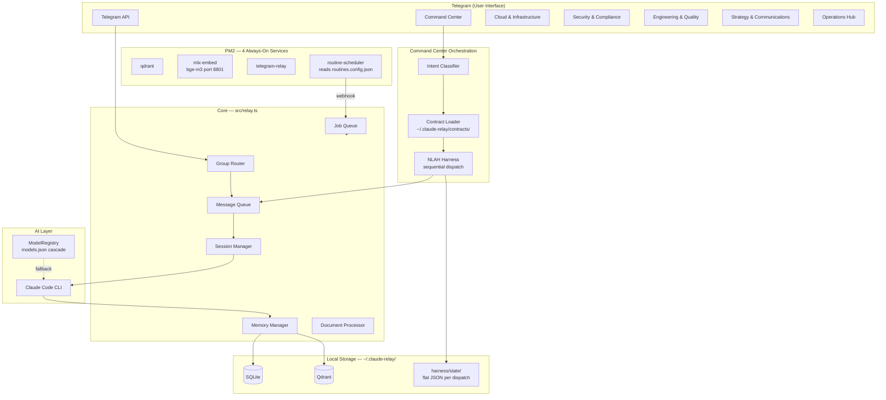
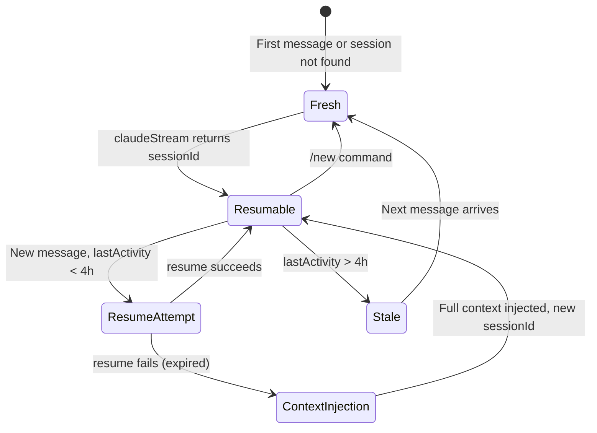

# Claude Telegram Relay — Setup Guide

> Claude Code reads this file automatically. Walk the user through setup one phase at a time.
> Ask for what you need, configure everything yourself, and confirm each step works before moving on.
>
> **When a user opens this project for the first time, greet them warmly and begin Phase 1 immediately. Do not wait for them to ask.**
>
> **For LLM agents working on routines:** Read `routines/CLAUDE.md` before creating, modifying, or debugging any file in `routines/`.
>
> **For LLM agents writing or reviewing E2E/integration tests:** Read `CLAUDE.e2e.md` before writing any test that touches Telegram bot behavior.
>
> **Todos/specs location:** Save all plans and todos to `~/.claude-relay/todos/` and all specs to `~/.claude-relay/specs/`. Do NOT write to `.claude/todos/` or `.claude/specs/` — the Claude Code harness blocks writes to `.claude/**` in non-interactive (bot) sessions. This project uses `~/.claude-relay/todos/` as the single source of truth for all plans and task tracking.
>
> **Service restart confirmation (MANDATORY):** Before executing any command that restarts or reloads the `telegram-relay` service (e.g. `npx pm2 restart telegram-relay`, `npx pm2 reload telegram-relay`), you MUST ask the user for explicit confirmation via Telegram inline keyboard — two buttons: Confirm restart and Cancel. Do NOT restart without a confirmed Yes. This applies to Claude Code agents operating in this project.
>
> **Temporary and session files:** Do NOT create temporary scripts, one-off tools, or session-scoped working files in the project root or `src/`. Save all temporary/session files to `.claude/workspace/` (e.g. `.claude/workspace/my-script.ts`). This directory is gitignored and meant for transient work. Delete temp files when the session task is complete.
>
> **Testing:** Always use `bun run test` to run the full test suite (runs tests in isolation). Use `bun test <file>` only for targeted single-file runs. Never use plain `bun test` for the full suite — it does not isolate mocks between files.
>
> **Job queue and routines:** Executor types are registered in `src/jobs/index.ts`. **Core routines** (system maintenance) live in `routines/handlers/` with config in `config/routines.config.json`. **User routines** (personal) live in `~/.claude-relay/routines/` with config in `~/.claude-relay/routines.config.json`. The executor resolves handlers from user directory first, then repo. Do NOT edit `ecosystem.config.cjs` for new routines — `routine-scheduler` is the sole cron dispatcher. See `routines/handlers/examples/` for annotated example handlers. `/schedule <prompt>` on Telegram enqueues a `claude-session` job and posts the result back to the originating chat.

## What This Is

This project turns Telegram into a personal AI assistant powered by Claude Code — with multi-agent group chats, persistent memory, scheduled routines, and agentic coding sessions you can start directly from Telegram.

**What you get:**
- 6 specialised AI agents, each in their own Telegram supergroup (Command Center, Cloud, Security, Engineering, Strategy, Operations)
- **NLAH command routing**: Command Center classifies intent, loads a Markdown contract, confirms with an inline button, then dispatches — single-agent or multi-step compound tasks
- Long-term memory: facts, goals, preferences stored locally with semantic search (SQLite + Qdrant + MLX bge-m3)
- Scheduled routines: morning briefing, evening summary, proactive check-ins, health watchdog — all config-driven via `config/routines.config.json`
- Document RAG: upload PDFs, ask questions, get answers grounded in your documents
- Voice transcription: send voice messages, bot transcribes and responds
- Job queue: persistent background job system with priority dispatch, interventions, and CLI/webhook/Telegram sources

**Everything runs locally.** No cloud database required. Once deployed, you talk to Claude through your phone.

---

## Architecture

### System Overview



### Data Directory

All user data lives outside the project directory in `~/.claude-relay/`:

```
~/.claude-relay/
  .env              # User-level environment overrides
  agents.json       # Agent chat IDs and topic IDs
  models.json       # ModelRegistry provider definitions + cascade order
  routines.config.json  # User routine schedules (merged with repo core config)
  data/
    local.sqlite    # Messages, memory, conversation summaries, documents (SQLite)
  sessions/         # Per-chat Claude session state files
  contracts/        # NLAH task contracts: <intent>.md (architecture, code-review, security-audit, research, default)
  harness/
    state/          # Flat JSON dispatch state per run: {dispatchId}.json
  logs/             # PM2 service logs
  prompts/          # Customizable agent prompts (copied from repo defaults)
  routines/         # User routine handlers (copied from repo examples on setup)
  research/         # Artifact outputs (reports, docs, security audits)
```

**Environment layering:** The bot loads `.env` from three sources in order (later values win):
1. Project `.env` (committed defaults / local dev overrides)
2. `~/.claude-relay/.env` (user-specific secrets and preferences)
3. `process.env` (runtime overrides)

**Prompt customization:** Agent prompts are loaded from `~/.claude-relay/prompts/` first, falling back to `config/prompts/` in the repo. Edit your user copy to personalize any agent without touching the repo.

**Storage stack:**
- **SQLite** (`~/.claude-relay/data/local.sqlite`) — messages, memory entries, goals, conversation summaries, documents
- **Qdrant** (local vector DB, port 6333) — semantic search over messages and memory
- **MLX** — `mlx serve-embed` for embeddings (bge-m3, port 8801). Text generation is handled by LM Studio (or any OpenAI-compatible server) via ModelRegistry — see `~/.claude-relay/models.json`.

### Component Map

| Component | File | Purpose |
|-----------|------|---------|
| Bot Core | `src/relay.ts` | Message routing, command handling, response pipeline |
| Claude Spawner | `src/claude-process.ts` | Spawn Claude CLI as subprocess; text and streaming modes |
| Memory Manager | `src/memory.ts` | Parse intent tags, dedup check, store to SQLite+Qdrant |
| Group Router | `src/routing/groupRouter.ts` | Map chatId to agentId; auto-discovery from group title |
| Prompt Builder | `src/agents/promptBuilder.ts` | Assemble final system prompt: agent + profile + context + memory |
| Session Manager | `src/session/groupSessions.ts` | Per-chat Claude session state, resume, /new reset |
| Message Queue | `src/queue/groupQueueManager.ts` | Per-chat FIFO queues with backpressure |
| Short-Term Memory | `src/memory/shortTermMemory.ts` | Rolling window (20 verbatim) + LLM summarization |
| Search Service | `src/local/searchService.ts` | Hybrid search: keyword (SQLite FTS5) + semantic (Qdrant) |
| Document Processor | `src/documents/documentProcessor.ts` | Ingest PDFs/XLSX/CSV: extract, chunk, embed, store |
| Job Queue | `src/jobs/jobQueue.ts` | Persistent background job system with priority dispatch |
| Model Registry | `src/model-registry/ModelRegistry.ts` | Cascade logic, health checks, provider selection |
| **Command Center** | `src/orchestration/commandCenter.ts` | CC group handler: intent confirm, inline keyboard, audit thread |
| **Intent Classifier** | `src/orchestration/intentClassifier.ts` | Classify free-text intent + confidence via local model |
| **Contract Loader** | `src/orchestration/contractLoader.ts` | Load `~/.claude-relay/contracts/<intent>.md`, parse steps |
| **NLAH Harness** | `src/orchestration/harness.ts` | Execute contract steps sequentially; write state JSON; post to CC thread |
| **Dispatch Engine** | `src/orchestration/dispatchEngine.ts` | Send task prompt to agent group, stream and collect response |

### Session Lifecycle



Session files: `~/.claude-relay/sessions/{chatId}_{threadId}.json`

---

## Multi-Agent Groups

The relay supports 6 specialised AI agents, each in its own Telegram supergroup with isolated sessions and scoped memory.

### Agent Directory

| Group Name | Agent ID | Specialty |
|---|---|---|
| Jarvis Command Center | `command-center` | NLAH intent routing, contract-driven dispatch, CC thread audit log |
| Cloud & Infrastructure | `cloud-architect` | AWS, CDK, GCC 2.0, cost optimisation, Well-Architected |
| Security & Compliance | `security-compliance` | IM8 v4, PDPA, security audits, threat modelling, runbooks |
| Engineering & Quality | `engineering` | Code review, TDD, refactoring, implementation |
| Strategy & Communications | `strategy-comms` | Proposals, BD materials, decks, research, ADRs |
| Operations Hub | `operations-hub` | General Q&A, meeting prep, task management (default) |

### How Routing Works

1. Message arrives with `chat_id`
2. Group router checks: runtime cache → auto-discovery (match group title) → env vars → agents.json → fallback to `operations-hub`
3. Matched agent's system prompt is loaded from `~/.claude-relay/prompts/{id}.md` (user copy) or `config/prompts/{id}.md` (repo default)
4. Claude spawns with the agent-specific prompt; memory queries filter by `chat_id`

### agents.json Schema

```json
{
  "id": "cloud-architect",
  "name": "Cloud & Infrastructure",
  "groupName": "Cloud & Infrastructure",
  "shortName": "Cloud",
  "groupKey": "CLOUD",
  "chatId": -1001234567890,
  "topicId": null,
  "capabilities": ["infrastructure-design", "cost-optimization"],
  "isDefault": false
}
```

- `config/agents.json` is **gitignored** — your real chat IDs stay local
- `config/agents.example.json` is the committed clean template
- `~/.claude-relay/agents.json` is created by setup and lives outside the repo

### Adding a Custom Agent

1. Create prompt: `~/.claude-relay/prompts/my-agent.md`
2. Create Telegram supergroup with exact `groupName`
3. Add entry to `config/agents.json` with `chatId`
4. Add bot as admin with **Manage Topics** permission
5. Restart relay — bot auto-discovers or uses explicit `chatId`

### Forum Topics

If supergroups have Forum Topics enabled, the bot routes messages to specific topics. Set `topicId` in agents.json or `GROUP_*_TOPIC_ID` in `.env`. Get a topic ID by right-clicking a topic in Telegram Desktop → Copy Link → extract the trailing number.

---

## Using the Bot

### Model Selection

| Prefix | Model | When to use |
|--------|-------|-------------|
| *(none)* | Claude Sonnet | Default — balanced speed and quality |
| `[O]` | Claude Opus | Complex architecture, deep reasoning |
| `[H]` | Claude Haiku | Quick questions, low-latency responses |

### Memory

The bot automatically extracts facts, goals, and preferences from conversations using intent tags (`[REMEMBER:]`, `[GOAL:]`, `[DONE:]`). Memory is scoped per-chat (or global with `[REMEMBER_GLOBAL:]`).

**Commands:** `/memory` (browse), `/remember [text]` (save), `/forget [text]` (remove), `/reflect [feedback]` (save learning)

### Goals

**Commands:** `/goals` (list), `/goals +text` (add), `/goals -text` (remove), `/goals *N` (mark done), `/goals *` (view completed)

### Documents

Upload PDFs/XLSX/CSV directly to Telegram. The bot extracts, chunks, embeds, and indexes them. Query with `/doc query [question]`.

**Commands:** `/doc list`, `/doc forget [name]`, `/doc query [question]`

### Voice

Send a voice message — the bot transcribes and responds. Configure `VOICE_PROVIDER=groq` (cloud, fast) or `VOICE_PROVIDER=local` (offline, whisper-cpp).

### Self-Learning

The bot captures learnings from corrections and `/reflect` feedback. Weekly retro (Sundays 9am) surfaces promotion candidates for `~/.claude/CLAUDE.md`. See [docs/memory-system.md](docs/memory-system.md) for details.

---

## Prerequisites

Before starting, verify you have:

- **Bun** `>= 1.0` — install from [bun.sh](https://bun.sh): `curl -fsSL https://bun.sh/install | bash`
- **Claude Code CLI** — `npm install -g @anthropic-ai/claude-code` then `claude login`
- **Git** and a terminal (macOS or Linux)
- A **Telegram account**

## Quick Start

If this is a fresh clone, run setup first:

```bash
bun run setup
```

This installs dependencies, creates `~/.claude-relay/` directories, copies default prompts, and prepares `.env` from the template. Then come back here.

---

## How This Guide Works

Claude Code reads this file and guides you through setup conversationally. Ask for what you need, and Claude configures everything for you — saving values to `.env`, running tests, and confirming each step before moving on.

Do not rush all phases at once. Start with Phase 1. When it works, move to Phase 2. You control the pace.

---

## Phase 1: Telegram Bot (~3 min)

**You need from the user:**
- A Telegram bot token from @BotFather
- Their personal Telegram user ID

**What to tell them:**
1. Open Telegram, search for @BotFather, send `/newbot`
2. Pick a display name and a username ending in "bot"
3. Copy the token BotFather gives them
4. Get their user ID by messaging @userinfobot on Telegram

**What you do:**
1. Run `bun run setup` if `.env` does not exist yet
2. Save `TELEGRAM_BOT_TOKEN` and `TELEGRAM_USER_ID` in `.env`
3. Run `bun run test:telegram` to verify — it sends a test message to the user

**Done when:** Test message arrives on Telegram.

---

## Phase 2: Local Memory & Search (~10 min)

Your bot's memory runs entirely locally — no cloud APIs needed. It uses SQLite for structured data, Qdrant for vector search, and MLX (bge-m3) for generating embeddings.

### Step 1: Install MLX embed (Apple Silicon — embeddings only)

MLX is used exclusively for generating embeddings (bge-m3, port 8801). Text generation for routines is handled by LM Studio or any OpenAI-compatible server configured in `~/.claude-relay/models.json`.

**What to tell them (macOS only):**
1. Ensure Python 3.12+ is installed: `brew install python@3.12`
2. Install the `mlx` CLI tool:
   ```bash
   uv tool install --editable tools/mlx-local --python python3.12
   ```

> **Cloudflare/corporate proxy:** The tool auto-injects `/etc/ssl/Cloudflare_CA.pem` if present. No manual cert config needed.

**Commands:**
| Command | What it does |
|---------|-------------|
| `mlx serve-embed` | Embedding-only API on `localhost:8801` |
| `mlx info` | Show cached models and sizes |

### Step 2: Start MLX embed server

**What to tell them:**
1. Start the embed server (model weights load on first request — allow ~30s):
   ```bash
   mlx serve-embed  # embeddings — port 8801
   ```
2. Verify it's running:
   ```bash
   curl http://localhost:8801/health   # → {"status":"ok","model":"...bge-m3..."}
   ```

**What you do:**
1. The env var is pre-configured. Optionally override in `~/.claude-relay/.env`:
   - `EMBED_URL=http://localhost:8801`

> **Apple Silicon only.** MLX requires Apple Silicon (M1/M2/M3/M4).

### Step 3: Install Qdrant

Qdrant is a local vector database for semantic search over messages and memory.

**What to tell them:**

**Option A — Binary (recommended):**
```bash
curl -L https://github.com/qdrant/qdrant/releases/latest/download/qdrant-$(uname -m)-apple-darwin.tar.gz | tar xz -C ~/.qdrant/bin/
```

**Option B — Docker:**
```bash
docker run -d --name qdrant -p 6333:6333 -v ~/.qdrant/storage:/qdrant/storage qdrant/qdrant
```

**What you do:**
1. Verify Qdrant is reachable: `curl http://localhost:6333/healthz`
2. The bot auto-creates its collections on first run — no manual schema setup needed

### Step 4: Verify

1. Confirm MLX embed server: `curl http://localhost:8801/health`
2. Confirm Qdrant is reachable: `curl http://localhost:6333/healthz`
3. Confirm SQLite database path exists: `ls ~/.claude-relay/data/`

**Done when:** Embed server responds on port 8801, Qdrant responds on port 6333, and `~/.claude-relay/data/` exists.

---

## Phase 3: Personalise (~5 min)

**Ask the user:**
- Their first name
- Their timezone (e.g., America/New_York, Europe/Berlin, Asia/Singapore)
- What they do for work (one sentence)
- Any time constraints (e.g., "I pick up my kid at 3pm on weekdays")
- How they like to be communicated with (brief/detailed, casual/formal)

**What you do:**
1. Save `USER_NAME` and `USER_TIMEZONE` to `.env`
2. Copy `config/profile.example.md` to `config/profile.md`
3. Fill in `config/profile.md` with their answers — the bot loads this on every message

> **Note:** `config/profile.md` is gitignored — it stays on this machine and is never committed.
> If the file already exists, overwrite it with the new user's details.

### Step 3b: Artifact Output

Agents save research, documentation, and security reports to `~/.claude-relay/research/`:
- `~/.claude-relay/research/ai-research/` — research reports
- `~/.claude-relay/research/ai-docs/` — documentation and write-ups
- `~/.claude-relay/research/ai-security/` — security reports

This directory is created automatically. No `.env` configuration needed.

**Done when:** `config/profile.md` exists with the user's details.

---

## Phase 4: Test — Single Chat (~2 min)

**What you do:**
1. Run `bun run start`
2. Tell the user to open Telegram and send a test message to their bot
3. Wait for confirmation it responded
4. Press Ctrl+C to stop

**Troubleshooting if it fails:**
- Wrong bot token → re-check with BotFather
- Wrong user ID → re-check with @userinfobot
- Claude CLI not found → `npm install -g @anthropic-ai/claude-code`
- Bun not installed → `curl -fsSL https://bun.sh/install | bash`

**Done when:** User confirms their bot responded on Telegram.

---

## Phase 5: Multi-Agent Groups (Optional, ~15 min)

This enables 6 specialised AI agents, each living in their own Telegram supergroup with a tailored persona. See the [Agent Directory](#agent-directory) above for the full list.

**Steps:**

1. For each agent, create a Telegram supergroup with the **exact group name** from the Agent Directory table
2. In each group: go to Settings → Make it a Supergroup (required for forum topic routing)
3. Add the bot to each group as an admin with **Manage Topics** permission enabled
4. Run `bun run test:groups` — the bot auto-discovers groups by matching their exact title

### Setting Chat IDs

If auto-discovery works, the bot resolves groups at runtime. If it fails, set them manually:

**Option A — Environment variables (simpler):**
```
GROUP_COMMAND_CENTER_CHAT_ID=-100xxxxxxxxxx
GROUP_CLOUD_CHAT_ID=-100xxxxxxxxxx
GROUP_SECURITY_CHAT_ID=-100xxxxxxxxxx
GROUP_ENGINEERING_CHAT_ID=-100xxxxxxxxxx
GROUP_STRATEGY_CHAT_ID=-100xxxxxxxxxx
GROUP_OPERATIONS_CHAT_ID=-100xxxxxxxxxx
```

**Option B — agents.json (persistent, recommended for long-term use):**
1. `~/.claude-relay/agents.json` was created by `bun run setup` with all `chatId` values set to `null`
2. Fill in the `chatId` field for each agent with the real group chat ID
3. Restart the bot

> **Note:** `~/.claude-relay/agents.json` is your personal config — it lives outside the repo and survives `git clean`.
> `config/agents.example.json` is the committed clean template. Never edit it directly.

**Done when:** `bun run test:groups` shows all groups discovered, or `chatId` values are set and the bot responds in each group.

---

## Phase 6: Always On with PM2 (~5 min)

Make the bot and all services run in the background, start on boot, restart on crash.

**What you do:**
```
bun run setup:pm2 -- --service all
```

This starts 4 always-on PM2 services:

| Service | What it does |
|---|---|
| `qdrant` | Local vector database |
| `mlx-embed` | MLX embedding server (bge-m3, port 8801) |
| `telegram-relay` | The main bot |
| `routine-scheduler` | Cron dispatcher — reads `config/routines.config.json` and submits jobs via webhook |

All scheduled routines (morning-summary, night-summary, smart-checkin, watchdog, etc.) are **config-driven** — defined in `config/routines.config.json`, not as individual PM2 entries. The routine-scheduler dispatches them automatically.

> To start only core services: `bun run setup:pm2 -- --service core`

**macOS alternative — launchd:**
```
bun run setup:launchd -- --service all
```

**Configure additional scheduled routines interactively:**
```
bun run setup:routines
```

**Verify:** `npx pm2 status`

> **Morning weather areas:** To show weather for specific areas in the morning summary, set:
> `WEATHER_AREAS=Your City,Another Area` in `.env` (comma-separated).

> **Log location:** All PM2 service logs are written to `~/.claude-relay/logs/`.

> **Routine guides:** `routines/CLAUDE.md` — developer code patterns and PM2 safety rules (read this before writing any routine). `routines/user_journey.md` — complete lifecycle guide for creating, scheduling, and managing routines via Telegram.

**Done when:** `npx pm2 status` shows all 4 services as "online" and survives a terminal close.

---

## Phase 7: Voice Transcription (Optional, ~5 min)

Lets the bot understand voice messages sent on Telegram.

**Ask the user which option they prefer:**

### Option A: Groq (Recommended — free cloud API)
- State-of-the-art Whisper model, sub-second speed
- Free: 2,000 transcriptions per day, no credit card
- Requires internet connection

**What to tell them:**
1. Go to console.groq.com and create a free account
2. Go to API Keys, create a new key, copy it

**What you do:**
1. Save `VOICE_PROVIDER=groq` and `GROQ_API_KEY` to `.env`
2. Run `bun run test:voice` to verify

### Option B: Local Whisper (offline, private)
- Runs entirely on their computer, no account needed
- Requires ffmpeg and whisper-cpp installed
- First run downloads a 142MB model file

**What you do:**
1. Check ffmpeg: `ffmpeg -version` (install: `brew install ffmpeg` or `apt install ffmpeg`)
2. Check whisper-cpp: `whisper-cpp --help` (install: `brew install whisper-cpp`)
3. Download model: `curl -L -o ~/whisper-models/ggml-base.en.bin https://huggingface.co/ggerganov/whisper.cpp/resolve/main/ggml-base.en.bin`
4. Save `VOICE_PROVIDER=local`, `WHISPER_BINARY`, `WHISPER_MODEL_PATH` to `.env`
5. Run `bun run test:voice` to verify

**Done when:** `bun run test:voice` passes.

---

## Phase 8: Local AI Fallback (~5 min)

When Claude is unavailable, the bot cascades to a local OpenAI-compatible server (LM Studio, Ollama, or any compatible provider). Providers and cascade order are configured in `~/.claude-relay/models.json`.

**Steps:**

1. Install and start an OpenAI-compatible local server, e.g. [LM Studio](https://lmstudio.ai) (port 1234) or Ollama (port 11434)
2. Load a model (e.g. Gemma 4B, Qwen 2.5, Mistral)
3. Edit `~/.claude-relay/models.json` — add the server under the `local` provider and set it in the cascade for the `chat` and `routine` slots
4. Restart the relay and send a message — if Claude is unreachable it will fall back automatically

> A template is at `config/models.example.json`. The ModelRegistry handles health checks and cascade ordering automatically.

**Done when:** Relay startup log shows the local provider is registered and responds to a test query.

---

## After Setup

Run the full health check:
```
bun run setup:verify
```

Summarise what was set up and what is running. Remind the user:
- Test by sending a message on Telegram
- Their bot runs in the background (if Phase 6 was done)
- Come back to this project folder and type `claude` anytime to make changes
- `config/profile.md` is gitignored — safe to customise freely
- `~/.claude-relay/agents.json` holds your chatIds — safe to edit, survives `git clean`
- Agent prompts can be customized at `~/.claude-relay/prompts/`

---

## Bot Commands Reference

| Command | What it does |
|---------|-------------|
| `/help` | All available commands |
| `/new` | Start a fresh conversation |
| `/status` | Session status |
| `/cancel` | Cancel in-progress Claude response |
| `/cwd [path]` | Set or show working directory for coding sessions |
| `/memory` | Browse your memory (goals, facts, prefs, dates) |
| `/remember [text]` | Save something to memory |
| `/forget [text]` | Remove something from memory |
| `/reflect [feedback]` | Save an explicit learning (confidence 0.85) |
| `/goals` | View and manage goals |
| `/goals +goal text` | Add a new goal |
| `/goals -old goal` | Remove a goal |
| `/goals *N or *text` | Mark goal as done (toggle active / done) |
| `/goals *` | View completed/archived goals |
| `/history` | Recent messages |
| `/routines` | Manage scheduled routines |
| `/jobs` | View and manage background jobs |
| `/schedule <prompt>` | Enqueue a Claude session job |
| `/doc list` | List uploaded documents |
| `/doc forget [name]` | Remove a document from memory |
| `/doc query [question]` | Search across all uploaded documents |

---

## Troubleshooting

| Symptom | Likely Cause | Fix |
|---------|-------------|-----|
| Bot not responding | Service offline | `npx pm2 status` — restart if `errored` |
| Response very slow | Large context window | `/new` to reset session |
| "Working..." never resolves | Claude stream hung | Send `/cancel` or restart relay |
| Memory not saving | Qdrant or MLX embed down | `curl http://localhost:6333/healthz`, `curl http://localhost:8801/health` |
| Voice not transcribing | Missing API key or binary | Check `VOICE_PROVIDER` + `GROQ_API_KEY` in `.env` |
| Document search returns nothing | No docs indexed or Qdrant down | `/doc list` to check, `bun run setup:verify` |
| Wrong group / agent not responding | Group not registered | Check `GROUP_*_CHAT_ID` or re-run `bun run test:groups` |
| Session resume fails every time | Stale session file | `/new` to reset, or delete `~/.claude-relay/sessions/{chatId}*.json` |
| Routine messages not arriving | routine-scheduler down | `npx pm2 logs routine-scheduler --lines 50` |

For deeper diagnostics, see [docs/observability.md](docs/observability.md).

---

## Deep Dive Documentation

| Document | What it covers |
|----------|----------------|
| [docs/nlah-harness.md](docs/nlah-harness.md) | NLAH harness: contract format, built-in contracts, dispatch state, customisation guide |
| [docs/memory-system.md](docs/memory-system.md) | Memory architecture: 3 layers, intent tags, dedup, prompt assembly, self-learning pipeline |
| [docs/routines-system.md](docs/routines-system.md) | Routines architecture: config-driven scheduling, handler API, creating routines |
| [docs/features-job-queue.md](docs/features-job-queue.md) | Job queue: executors, CLI, webhook API, interventions, auto-approve |
| [docs/observability.md](docs/observability.md) | Logging, PM2 status, trace IDs, watchdog, troubleshooting |
| [docs/model-registry.md](docs/model-registry.md) | ModelRegistry cascade, MLX embed setup, local AI fallback |
| [docs/weather.md](docs/weather.md) | Weather integration: Singapore NEA + Open-Meteo, API reference |
| [routines/CLAUDE.md](routines/CLAUDE.md) | Developer guide for writing routine handlers |
| [integrations/CLAUDE.md](integrations/CLAUDE.md) | Claude CLI integration API: runPrompt, claudeText, claudeStream |
| `~/.claude-relay/contracts/` | NLAH contracts: edit `<intent>.md` to change routing without touching code |

---

## What Comes Next

- **6 Specialised AI Agents** — each with a tailored persona in its own Telegram supergroup. Edit prompts at `~/.claude-relay/prompts/` to change any agent's focus, tone, or save paths.
- **Production Routines** — the `routines/` directory has ready-to-use scheduled tasks. Read `routines/CLAUDE.md` then `routines/user_journey.md` before creating your own.
- **Document RAG** — upload PDFs to Telegram, query them with natural language via `/doc query`
- **Forum Topic Support** — route messages to specific topics within supergroups for clean separation
- **Fallback AI** — auto-cascade to local LM Studio / Ollama when Claude is unavailable, via ModelRegistry (`~/.claude-relay/models.json`)
- **Fully Local** — all data stays on your machine (SQLite + Qdrant + MLX embed)

**Want to personalise further?**
- Edit `~/.claude-relay/prompts/*.md` to change each agent's persona, domain focus, or save paths
- Edit `config/profile.md` to update your profile (the bot reads this on every message)
- Add new agents by creating entries in `config/agents.json` and prompts in `~/.claude-relay/prompts/`
