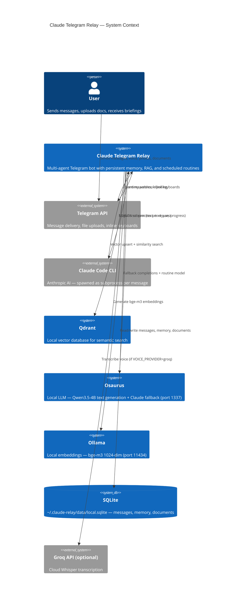
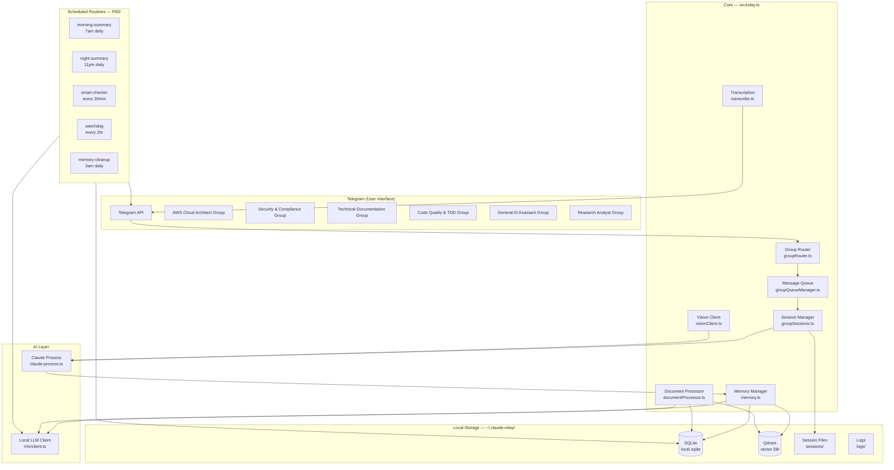
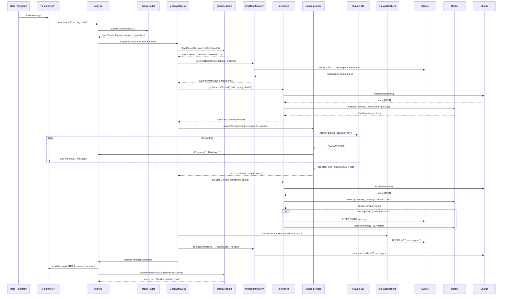
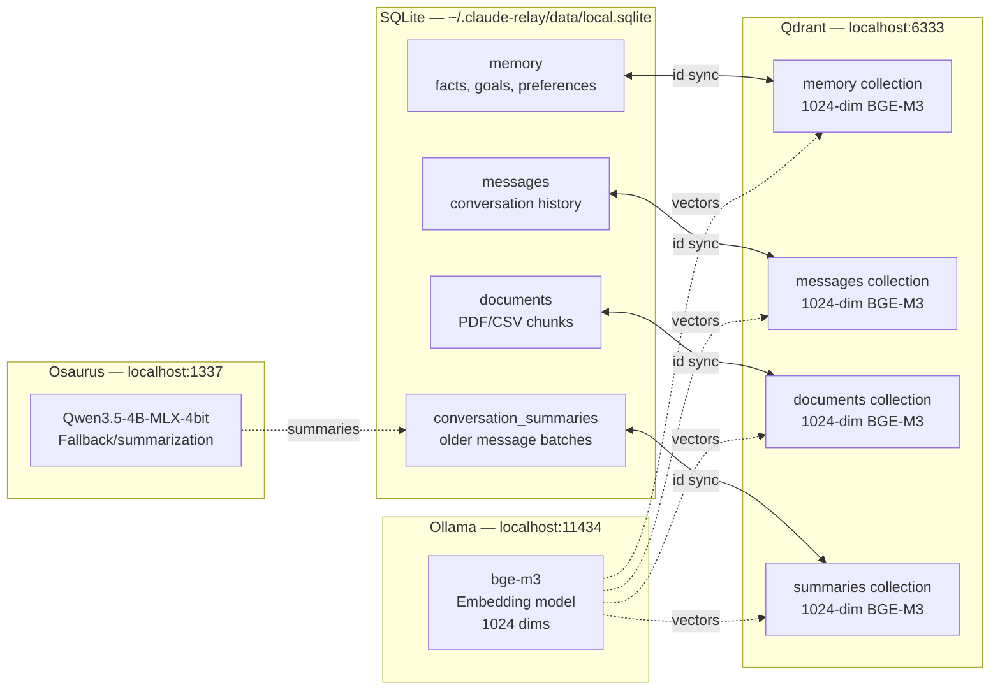
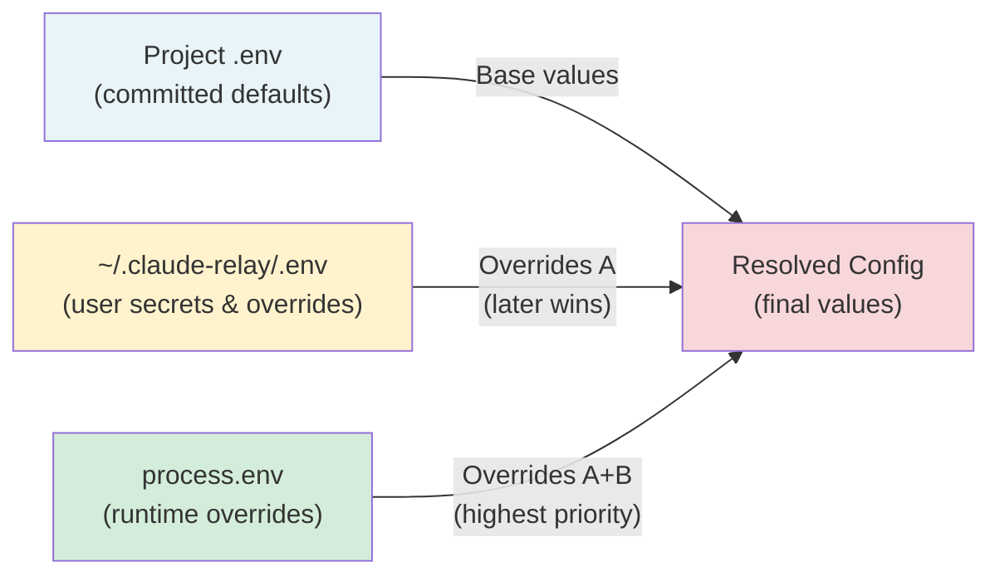
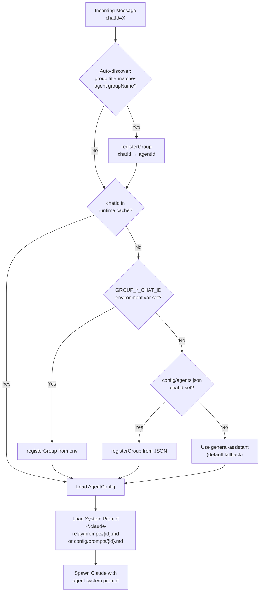
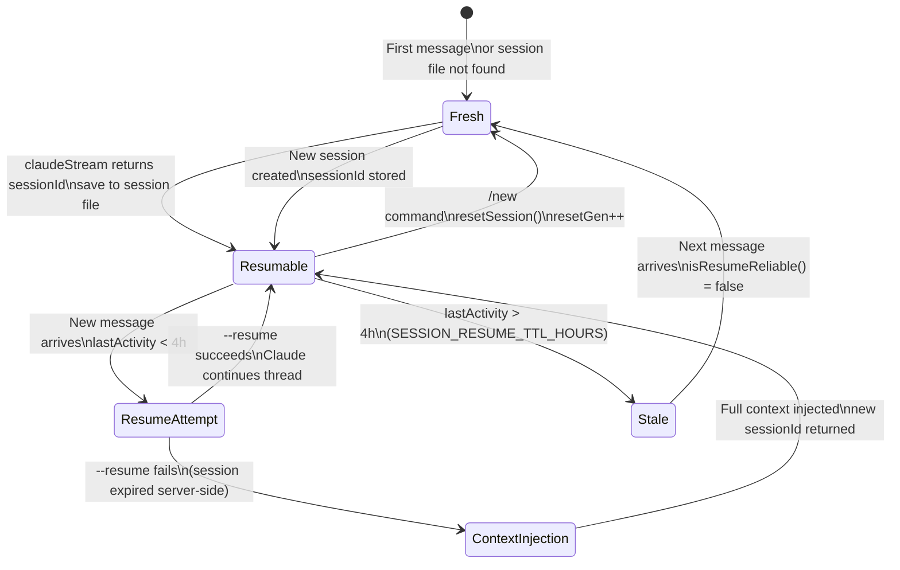

# Claude Telegram Relay — System Architecture

**Version**: 1.0 | **Date**: 2026-03-21 | **Status**: Current

---

## Table of Contents

1. [Executive Summary](#executive-summary)
2. [High-Level Architecture](#high-level-architecture)
3. [Component Breakdown](#component-breakdown)
4. [End-to-End Message Flow](#end-to-end-message-flow)
5. [Storage Architecture](#storage-architecture)
6. [Directory Structure](#directory-structure)
7. [Environment Configuration Layering](#environment-configuration-layering)
8. [Agent Routing Architecture](#agent-routing-architecture)
9. [Session Management](#session-management)
10. [Technology Stack](#technology-stack)

---

## Executive Summary

Claude Telegram Relay is a production-ready personal AI assistant that turns Telegram into a multi-agent workspace powered by Anthropic's Claude Code CLI. The system runs entirely locally — no cloud databases, no third-party memory services.

**Core capabilities:**
- **6 specialised AI agents**, each living in a dedicated Telegram supergroup with a tailored persona
- **Persistent local memory** — facts, goals, and preferences stored in SQLite with semantic search via Qdrant + Ollama bge-m3
- **Scheduled routines** — 12 PM2-managed cron jobs for morning briefings, health checks, investment screening, and memory maintenance
- **Document RAG** — upload PDFs/XLSX/CSV, query with natural language
- **Voice transcription** — Groq (cloud) or local Whisper
- **Session continuity** — Claude Code sessions are resumed across conversations via `--resume`

All user data is externalised to `~/.claude-relay/` — the project directory contains no user secrets or state.

---

## High-Level Architecture





---

## Component Breakdown

| Component | File | Responsibility | Key Dependencies |
|-----------|------|----------------|-----------------|
| **Bot Core** | `src/relay.ts` | Message routing, command handling, response pipeline (3,100+ lines) | grammy, claude-process, memory, queue |
| **Claude Spawner** | `src/claude-process.ts` | Spawn Claude Code CLI as subprocess; text and streaming modes | Node child_process |
| **Memory Manager** | `src/memory.ts` | Parse intent tags, dedup check, store to SQLite+Qdrant | storageBackend, embed, vectorStore |
| **Group Router** | `src/routing/groupRouter.ts` | Map chatId → agentId; auto-discovery from group title | agents/config |
| **Agent Config** | `src/agents/config.ts` | Load agent definitions + system prompts (user override → repo default) | config/paths |
| **Prompt Builder** | `src/agents/promptBuilder.ts` | Assemble final system prompt: agent + profile + context + memory | shortTermMemory, memory |
| **Session Manager** | `src/session/groupSessions.ts` | Per-chat Claude session state: sessionId, resume reliability, /new reset | fs (disk persistence) |
| **Message Queue** | `src/queue/groupQueueManager.ts` | Per-chat FIFO queues, backpressure, idle cleanup | messageQueue |
| **Short-Term Memory** | `src/memory/shortTermMemory.ts` | Rolling window (20 verbatim) + local LLM summarization of older chunks | db, mlx/client |
| **Storage Backend** | `src/local/storageBackend.ts` | Unified CRUD: route ops to SQLite + Qdrant | db, vectorStore, embed |
| **SQLite DB** | `src/local/db.ts` | Schema, CRUD, WAL mode, all table operations | bun:sqlite |
| **Vector Store** | `src/local/vectorStore.ts` | Qdrant REST client: upsert, search, delete, init collections | @qdrant/js-client-rest |
| **Embeddings** | `src/local/embed.ts` | Generate 1024-dim bge-m3 vectors via Ollama `/api/embed` (8s timeout) | Ollama HTTP API |
| **Search Service** | `src/local/searchService.ts` | Hybrid search: keyword (SQLite FTS) + semantic (Qdrant) | db, vectorStore, embed |
| **Document Processor** | `src/documents/documentProcessor.ts` | Ingest PDFs/XLSX/CSV: extract, chunk, embed, store | unpdf, xlsx, embed, vectorStore |
| **Vision Client** | `src/vision/visionClient.ts` | Analyze photos via Claude Sonnet subprocess | claude-process |
| **Transcription** | `src/transcribe.ts` | Voice → text via Groq API or local whisper-cpp | groq-sdk |
| **Routine Manager** | `src/routines/routineManager.ts` | Discover and register PM2 routine services | PM2 API |
| **Env Loader** | `src/config/envLoader.ts` | Layered .env: project → `~/.claude-relay/.env` → process.env | dotenv |
| **Bot Commands** | `src/commands/botCommands.ts` | /help, /new, /memory, /goals, /history, /routines | memoryCommands |
| **Cancel Handler** | `src/cancel.ts` | Interrupt active Claude streams via callback or /cancel | active stream registry |
| **Local LLM Client** | `src/mlx/client.ts` | Osaurus HTTP client with availability check, text generation | Osaurus HTTP API (port 1337) |
| **Routine Model** | `src/routines/routineModel.ts` | Local LLM model for all scheduled routines (Osaurus) | Osaurus HTTP API |

---

## End-to-End Message Flow



---

## Storage Architecture



### SQLite Tables

| Table | Rows Stored | Key Columns | Purpose |
|-------|-------------|-------------|---------|
| `memory` | Facts, goals, preferences | `chat_id`, `type`, `content`, `status`, `category`, `confidence` | Long-term agent memory |
| `messages` | Every user/assistant message | `chat_id`, `thread_id`, `role`, `content`, `agent_id` | Conversation history |
| `documents` | PDF/CSV/XLSX chunks | `name`, `content`, `chunk_index`, `content_hash` | Document RAG source |
| `conversation_summaries` | Summarized old message batches | `summary`, `message_count`, `from_timestamp`, `to_timestamp` | Short-term memory compression |

### Qdrant Collections

| Collection | Vector Dims | Distance | Payload Fields | Purpose |
|------------|-------------|----------|----------------|---------|
| `memory` | 1024 | Cosine | `chat_id`, `type`, `content`, `category` | Semantic memory search |
| `messages` | 1024 | Cosine | `chat_id`, `thread_id`, `role`, `agent_id` | Semantic message search |
| `documents` | 1024 | Cosine | `name`, `chunk_heading`, `chat_id` | Document RAG search |
| `summaries` | 1024 | Cosine | `chat_id`, `thread_id`, `from_timestamp` | Summary search |

---

## Directory Structure

```
Project Directory: ~/Documents/.../claude-telegram-relay/
├── src/                    # Application source code
│   ├── relay.ts            # Core bot (3,100+ lines)
│   ├── claude-process.ts   # Claude CLI spawner
│   ├── memory.ts           # Memory intent engine
│   ├── agents/             # Agent definitions + prompt assembly
│   ├── routing/            # Chat → agent mapping
│   ├── session/            # Per-chat Claude session state
│   ├── memory/             # Short-term + long-term memory modules
│   ├── local/              # SQLite + Qdrant clients
│   ├── queue/              # Per-chat FIFO message queues
│   ├── commands/           # Bot command handlers
│   ├── documents/          # Document ingest + RAG
│   ├── rag/                # Document search service
│   ├── vision/             # Image analysis
│   ├── routines/           # Routine manager
│   ├── interactive/        # AskUserQuestion session runner
│   ├── config/             # Env loader, group resolver, paths
│   ├── mlx/                # MLX HTTP client (health check, generation, embeddings)
│   └── utils/              # Formatters, senders, tracer
├── routines/               # Scheduled cron scripts (PM2)
├── config/
│   ├── agents.json         # Agent definitions (gitignored)
│   ├── agents.example.json # Committed template
│   ├── prompts/            # Default agent system prompts
│   └── profile.md          # User profile (gitignored)
├── setup/                  # Setup and test scripts
├── integrations/           # External service adapters
├── tests/                  # Unit + E2E tests
├── docs/                   # Documentation
├── ecosystem.config.cjs    # PM2 service definitions
└── relay-wrapper.js        # PM2 entry point for main bot

External Data: ~/.claude-relay/   (NEVER in project dir)
├── .env                    # User-specific secrets + overrides
├── data/
│   └── local.sqlite        # All persistent data
├── sessions/               # Per-chat Claude session files
│   └── {chatId}_{threadId}.json
├── logs/                   # PM2 service logs
│   ├── telegram-relay.log
│   ├── morning-summary.log
│   └── ...
├── prompts/                # User-customized agent prompts
│   ├── aws-architect.md
│   ├── general-assistant.md
│   └── ...
└── research/               # Artifact outputs
    ├── ai-docs/
    ├── ai-research/
    └── ai-security/
```

---

## Environment Configuration Layering



**Loading order** (implemented in `src/config/envLoader.ts`):
1. Parse `{project}/.env`
2. Parse `~/.claude-relay/.env` — user-level secrets (TELEGRAM_BOT_TOKEN, API keys)
3. `process.env` — runtime overrides (e.g., CI/CD injection)

Later values **win**. This means user secrets always override project defaults without touching the committed codebase.

---

## Agent Routing Architecture



**Prompt loading priority** (first found wins):
1. `~/.claude-relay/prompts/{agentId}.md` — user's personalised copy
2. `config/prompts/{agentId}.md` — committed repo default
3. Minimal inline fallback: `"You are a helpful AI assistant ({agentId})."`

---

## Session Management



**Session file location**: `~/.claude-relay/sessions/{chatId}_{threadId}.json`

**Key fields:**

| Field | Type | Purpose |
|-------|------|---------|
| `sessionId` | `string \| null` | Claude Code session ID for `--resume` |
| `lastActivity` | `string` | ISO timestamp — determines resume reliability |
| `resetGen` | `number` | Incremented on `/new` — prevents stale callbacks from updating wrong session |
| `pendingContextInjection` | `boolean` | True when `--resume` failed — inject full context on next message |
| `cwd` | `string?` | User-configured working directory for Claude |

---

## Technology Stack

| Layer | Technology | Version | Purpose |
|-------|-----------|---------|---------|
| **Runtime** | Bun | ≥ 1.0 | TypeScript execution, native SQLite, fast startup |
| **Bot Framework** | grammy | latest | Telegram Bot API (webhooks/polling, inline keyboards) |
| **AI (primary)** | Claude Code CLI | latest | Core AI — spawned as subprocess per request |
| **AI (fallback/routines)** | Osaurus | latest | Apple Silicon native — Qwen3.5-4B text generation (port 1337) |
| **Embeddings** | Ollama + bge-m3 | latest | 1024-dim semantic vectors via `/api/embed` (port 11434) |
| **Vector DB** | Qdrant | latest | Local semantic search — 4 collections |
| **Relational DB** | SQLite (bun:sqlite) | native | Messages, memory, documents, summaries |
| **Voice (cloud)** | Groq SDK | latest | Whisper transcription (optional) |
| **Voice (local)** | whisper-cpp | latest | Offline transcription (optional) |
| **PDF Extraction** | unpdf | latest | PDF text extraction |
| **Spreadsheet** | xlsx | latest | XLSX/CSV parsing |
| **Process Manager** | PM2 | latest | 12 services with cron scheduling |
| **Language** | TypeScript | 5.x | Full type safety across codebase |
| **Finance Data** | yahoo-finance2 | latest | ETF screening routines |
| **Weather** | Open-Meteo / NEA | — | Weather data for morning briefing |
