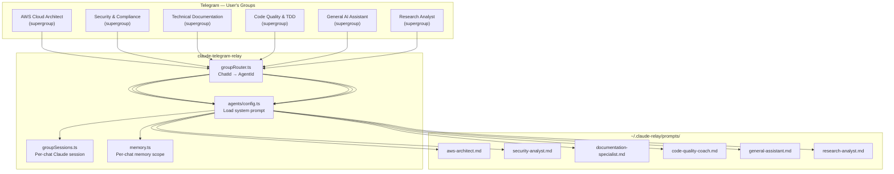
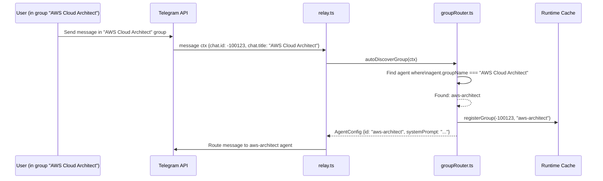
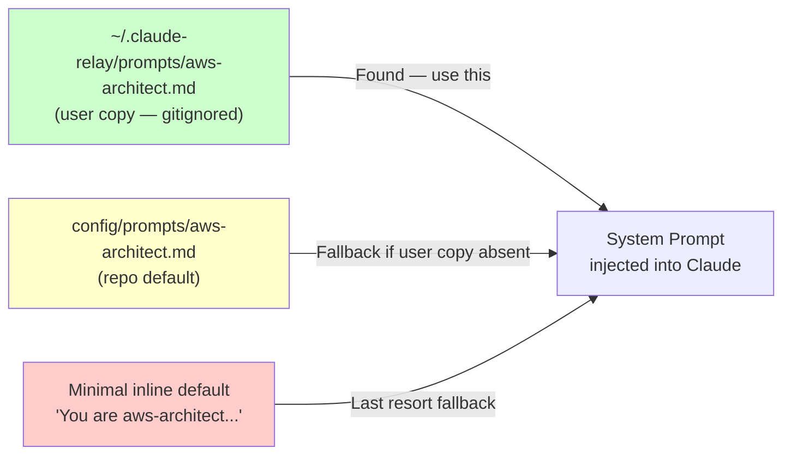
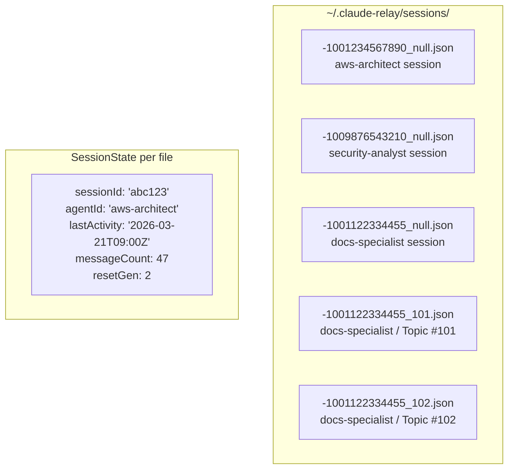
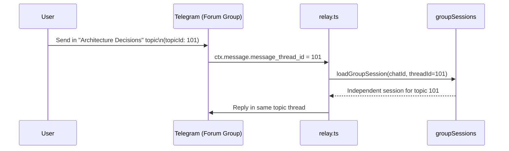

# Claude Telegram Relay — Multi-Agent Chat Groups

**Version**: 1.0 | **Date**: 2026-03-21

---

## Table of Contents

1. [Overview](#overview)
2. [Agent Directory](#agent-directory)
3. [How Message Routing Works](#how-message-routing-works)
4. [Group Auto-Discovery](#group-auto-discovery)
5. [Manual Group Configuration](#manual-group-configuration)
6. [Prompt Customisation](#prompt-customisation)
7. [Per-Chat Session Isolation](#per-chat-session-isolation)
8. [Forum Topic Routing](#forum-topic-routing)
9. [agents.json Schema](#agentsjson-schema)
10. [Adding a Custom Agent](#adding-a-custom-agent)

---

## Overview

The relay supports multiple **specialised AI agents**, each deployed into its own Telegram supergroup. Each agent has:

- A **tailored system prompt** defining its persona, domain expertise, and output format
- An **isolated Claude session** — conversations in one group do not bleed into another
- **Scoped memory** — facts and goals are scoped to each group's `chat_id`
- A **dedicated Telegram supergroup** with an exact name the bot uses for auto-discovery



---

## Agent Directory

| Agent ID | Telegram Group Title | Specialty | Key Capabilities |
|----------|---------------------|-----------|-----------------|
| `aws-architect` | `AWS Cloud Architect` | AWS infrastructure, CDK, cost optimisation, Well-Architected | CloudFormation, CDK, EC2, EKS, IAM, S3, cost analysis |
| `security-analyst` | `Security & Compliance` | Security audits, IM8 compliance, threat modelling, PDPA | Threat modelling, IM8 Annex B, PDPA, vulnerability analysis |
| `documentation-specialist` | `Technical Documentation` | ADRs, system design docs, runbooks, RFCs | ADR template, SDD, API docs, process guides |
| `code-quality-coach` | `Code Quality & TDD` | Code review, test generation, refactoring | TDD, code smells, refactor patterns, test coverage |
| `research-analyst` | `Research Analyst` | Research reports, competitive analysis, technical papers | Web research, synthesis, structured reports |
| `general-assistant` | `General AI Assistant` | General Q&A, planning, summaries, meeting notes | Catch-all, task breakdown, meeting synthesis |

---

## How Message Routing Works

```mermaid
flowchart TD
    MSG[Telegram message\nchat_id = -1001234567890] --> CACHE{chatId in\nruntime cache?}

    CACHE -->|Yes| AGENT[Return cached agentConfig]

    CACHE -->|No| DISC{Auto-discovery:\nFetch group title,\nmatch to agentGroupName?}

    DISC -->|Match found| REG_DISC[registerGroup\nchatId → matched agentId\nCache it]
    DISC -->|No match| ENV{GROUP_*_CHAT_ID\nenv var set for this chatId?}

    ENV -->|Yes| REG_ENV[registerGroup from .env\nCache it]
    ENV -->|No| JSON{config/agents.json\nchatId matches?}

    JSON -->|Yes| REG_JSON[registerGroup from agents.json\nCache it]
    JSON -->|No| DEFAULT[Fallback:\ngeneral-assistant]

    REG_DISC --> AGENT
    REG_ENV --> AGENT
    REG_JSON --> AGENT
    DEFAULT --> AGENT

    AGENT --> PROMPT[Load system prompt:\n1. ~/.claude-relay/prompts/{id}.md\n2. config/prompts/{id}.md\n3. Minimal inline fallback]

    PROMPT --> CLAUDE[Spawn Claude with\nagent system prompt]
```

**Priority order for group registration:**
1. **Runtime cache** — fastest, no I/O
2. **Auto-discovery** — match Telegram group title to `agent.groupName`
3. **Environment variables** — `GROUP_AWS_CHAT_ID`, `GROUP_SECURITY_CHAT_ID`, etc.
4. **agents.json** — explicit `chatId` set by user
5. **Fallback** — `general-assistant` for unregistered chats

---

## Group Auto-Discovery

Auto-discovery is the recommended configuration method. The bot automatically detects which agent should handle a chat by matching the group title.



**Exact title matching**: The group title must match **exactly** (case-sensitive, including spaces). Use the names in the [Agent Directory](#agent-directory) table.

---

## Manual Group Configuration

If auto-discovery fails (e.g., the group was renamed), configure manually.

### Option A: Environment Variables

Add to `~/.claude-relay/.env`:

```bash
GROUP_AWS_CHAT_ID=-1001234567890
GROUP_SECURITY_CHAT_ID=-1009876543210
GROUP_DOCS_CHAT_ID=-1001122334455
GROUP_CODE_CHAT_ID=-1005566778899
GROUP_GENERAL_CHAT_ID=-1000011223344
GROUP_RESEARCH_CHAT_ID=-1009988776655
```

**How to get a chat ID**: Run `bun run test:groups` — it prints all discovered group IDs, or forward a message from the group to `@userinfobot`.

### Option B: agents.json

Edit `config/agents.json` (gitignored, safe to modify):

```json
{
  "id": "aws-architect",
  "chatId": -1001234567890,
  "topicId": null
}
```

Then restart the relay: `npx pm2 restart telegram-relay`

---

## Prompt Customisation

Each agent's behaviour is controlled by its system prompt. You can personalise prompts without modifying the committed codebase.



**To customise an agent:**
1. The user copy is created during setup: `~/.claude-relay/prompts/aws-architect.md`
2. Edit it freely — changes take effect on next message (prompts are loaded per-request)
3. To reset to defaults: delete the user copy, the bot will use the repo default

**Example customisation** (`~/.claude-relay/prompts/aws-architect.md`):
```markdown
You are an AWS Cloud Architect specialising in Singapore government cloud infrastructure.

Focus areas:
- GCC (Government Commercial Cloud) patterns
- IM8 compliance for AWS workloads
- Cost optimisation for GovTech workloads

Save architecture documents to: ~/.claude-relay/research/ai-docs/
```

---

## Per-Chat Session Isolation

Each Telegram group (and each forum topic within a group) gets its own **independent Claude session**:



**What isolation provides:**
- No context bleed between groups (asking about security in AWS group won't affect Security group)
- Independent `--resume` continuity per group
- Per-group `/new` resets — resetting one group doesn't affect others
- Per-group working directory (`/cwd`)

**Session file naming**: `{chatId}_{threadId}.json`
- `threadId = null` → main group chat (serialised as `"null"` in filename)
- `threadId = 101` → forum topic #101

---

## Forum Topic Routing

If your supergroup has **Forum Topics** enabled, the bot can route responses to specific topics.



**To get a topic ID**: Right-click a topic in Telegram Desktop → Copy Link → extract the trailing number.

**Configure in agents.json:**
```json
{
  "id": "documentation-specialist",
  "topicId": 101
}
```

**Configure in .env:**
```bash
GROUP_DOCS_TOPIC_ID=101
GROUP_GENERAL_TOPIC_ID=789
```

---

## agents.json Schema

The full schema for `config/agents.json` (based on `config/agents.example.json`):

```json
[
  {
    // Required fields
    "id": "aws-architect",              // Unique agent identifier (used for prompt file lookup)
    "name": "AWS Cloud Architect",      // Display name
    "groupName": "AWS Cloud Architect", // Exact Telegram group title (for auto-discovery — case-sensitive)
    "shortName": "AWS",                 // Short label shown in footers

    // Group configuration (at least one method required)
    "groupKey": "AWS_ARCHITECT",        // Key in GROUPS env map (GROUP_AWS_ARCHITECT_CHAT_ID)
    "chatId": -1001234567890,           // Telegram supergroup ID (null if using auto-discovery)
    "topicId": null,                    // Forum topic ID (null = main group chat)

    // Agent behaviour
    "claudeAgent": "architect.md",      // Optional: Claude agent reference file
    "capabilities": [                   // Hints for routing decisions
      "infrastructure-design",
      "cost-optimization",
      "aws-architecture"
    ],
    "isDefault": false                  // If true, handles unregistered chats
  }
]
```

**Notes:**
- `config/agents.json` is **gitignored** — your real chat IDs stay local
- `config/agents.example.json` is the committed template — never modify it directly
- Changes to agents.json take effect on relay restart: `npx pm2 restart telegram-relay`

---

## Adding a Custom Agent

### Step 1: Create the Prompt File

```bash
# Create user-level prompt
cat > ~/.claude-relay/prompts/my-custom-agent.md << 'EOF'
You are a specialised AI assistant focused on [your domain].

Key responsibilities:
- [Task 1]
- [Task 2]

Output format:
- [Preferred format]

Save artifacts to: ~/.claude-relay/research/ai-docs/
EOF
```

### Step 2: Create a Telegram Supergroup

1. Create a new Telegram Supergroup
2. Name it exactly as your `groupName` value (e.g., `My Custom Agent`)
3. Add your bot as admin
4. Note the group chat ID (message `@userinfobot` or use `bun run test:groups`)

### Step 3: Add to agents.json

```json
{
  "id": "my-custom-agent",
  "name": "My Custom Agent",
  "groupName": "My Custom Agent",
  "shortName": "Custom",
  "groupKey": "MY_CUSTOM_AGENT",
  "chatId": -100XXXXXXXXXX,
  "topicId": null,
  "capabilities": ["my-domain"],
  "isDefault": false
}
```

### Step 4: Restart Relay

```bash
npx pm2 restart telegram-relay
```

### Step 5: Verify

Send a message in the new group. The bot should respond using your custom agent's persona.

```bash
# Check routing
npx pm2 logs telegram-relay --lines 20 | grep "my-custom-agent"
```
