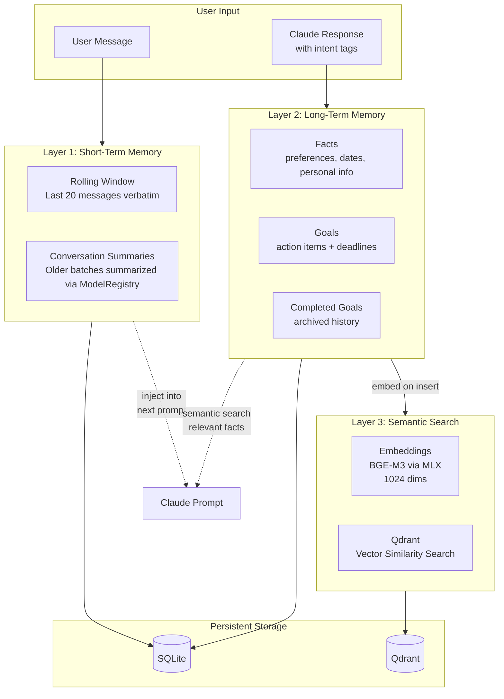
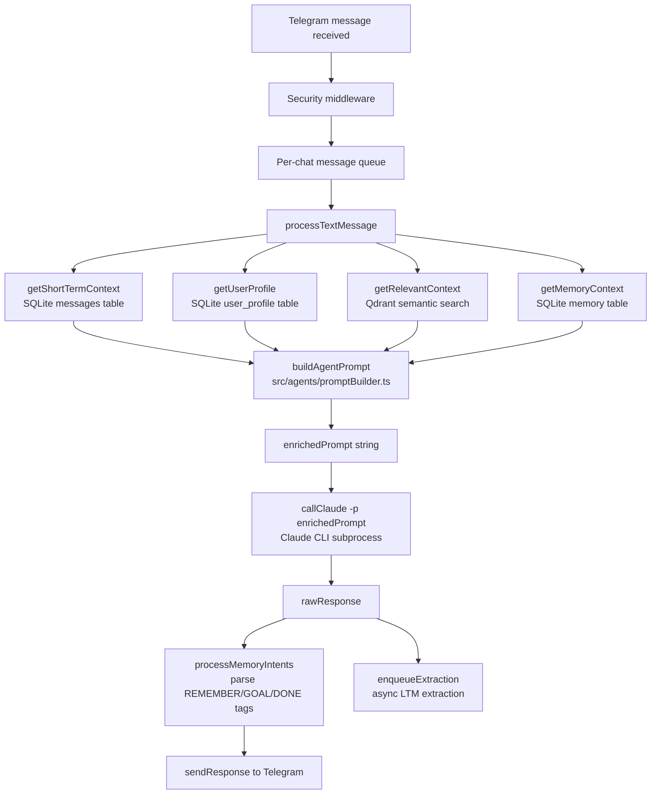
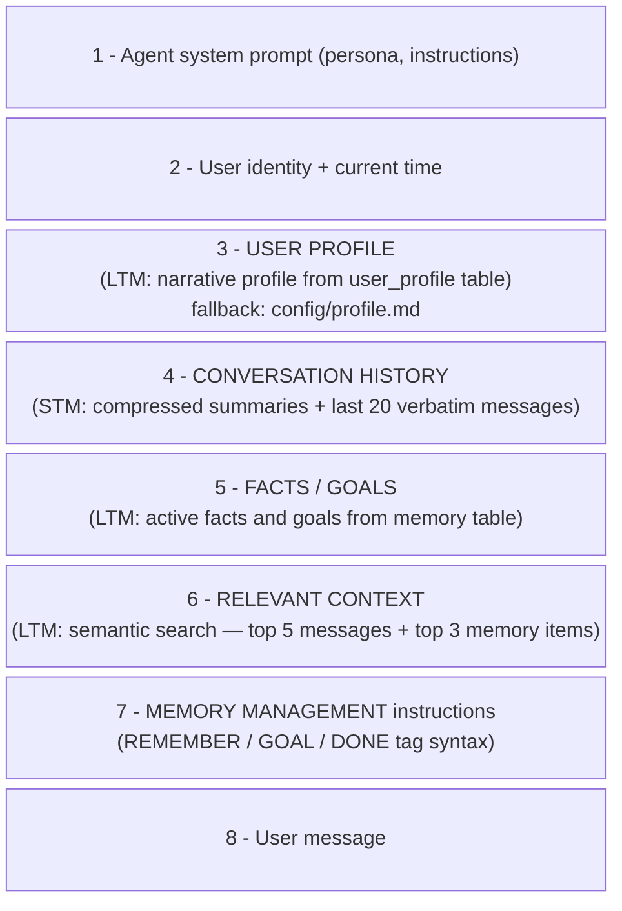
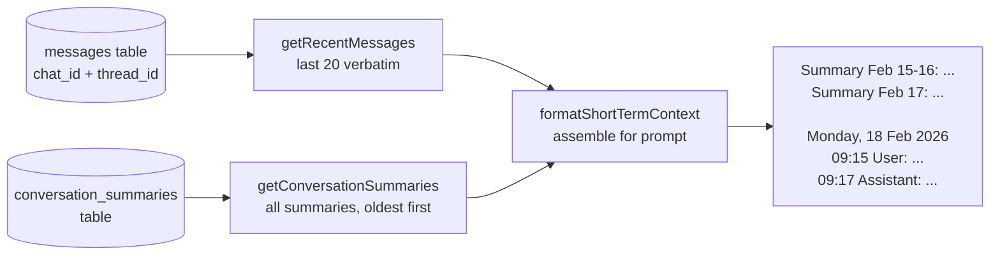
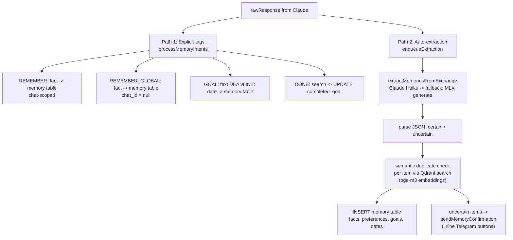
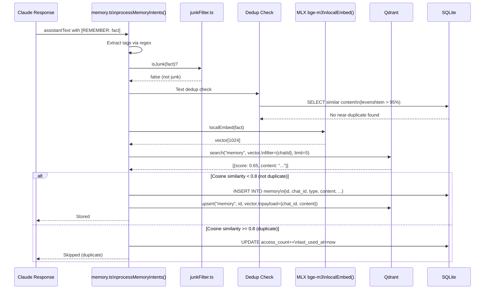
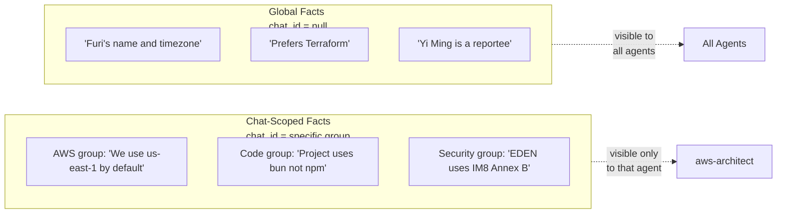
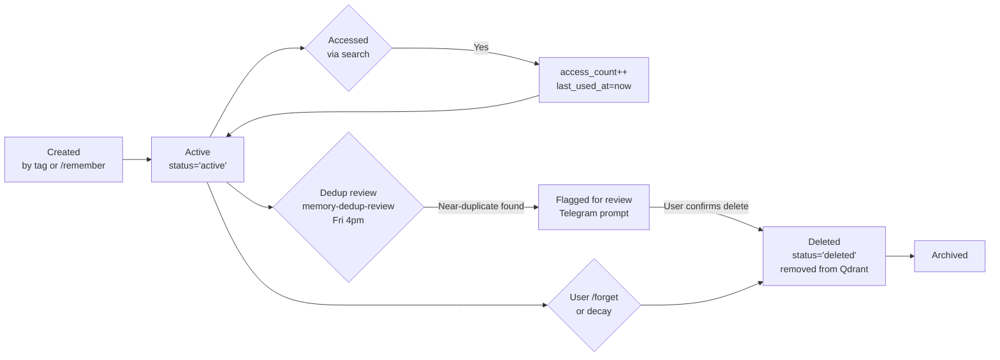
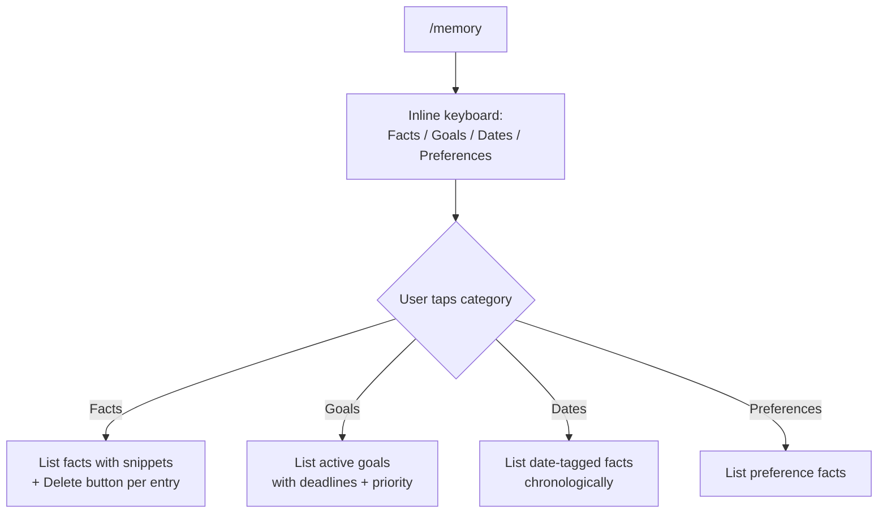

# Claude Telegram Relay — Memory System

**Version**: 1.2 | **Date**: 2026-04-12

---

## Overview

The memory system gives the relay bot persistent, personalized context that survives across sessions and days. It operates at three levels — immediate conversation context, long-term facts and goals, and semantic search — all stored locally with no cloud dependency.



---

## User Guide

A plain-language guide for how Jarvis remembers things.

### Where Does Stored Memory Go?

All memory is saved locally in SQLite (`~/.claude-relay/data/local.sqlite`) with semantic search powered by Qdrant and MLX bge-m3 embeddings. Each entry has a type:

| Type | Examples |
|------|----------|
| **Fact** | "User works on SCTD LTA initiatives", "User is on macOS" |
| **Goal** | "Implement GitLab PEP by May 2026" |
| **Preference** | "User prefers concise responses" |
| **Date** | "Meeting on 5 Mar 2026 regarding PEP" |

Memory persists across sessions — closing Telegram or restarting the bot does not erase it.

### How Does the "I Noticed..." Prompt Appear?

After every message you send, Jarvis analyses the exchange (your message + its response) using a lightweight AI model. It looks for:

- **Things you stated clearly** — stored automatically, no prompt shown
- **Things that are implied or ambiguous** — shown to you as a confirmation prompt:

```
I noticed a few things you might want me to remember:

* Whether these are active production problems or preventive architectural planning
* Which specific project/workflow component these relate to

Save these?   [Save all]   [Skip all]
```

Tap **Save all** to confirm, or **Skip all** to discard. Nothing ambiguous is saved without your approval.

### When Is Memory Used?

Every time you send a message, before Jarvis replies, it automatically retrieves:

| What | How |
|------|-----|
| **All active facts and goals** | Fetched directly — up to 50 facts and 20 goals |
| **Semantically relevant past context** | Top 5 past messages + top 3 memory items most similar to your current message |

This happens silently on every message — you do not need to ask Jarvis to "remember" or "look up" anything.

### Where Does Retrieved Memory Go?

The retrieved memory is inserted into Jarvis's prompt **before** it reads your message. It looks like this internally:

```
<memory>
Facts:
- User works on SCTD LTA initiatives
- User prefers concise responses
- User is on macOS

Goals:
- Implement GitLab PEP by May 2026
</memory>

[Your message here]
```

This means Jarvis "knows" your context before it starts composing a reply — without you having to re-explain it each time.

### How to Manage Your Memory

| Command | What it does |
|---------|--------------|
| `/memory` | View all stored facts, goals, preferences, and dates |
| `/remember [text]` | Explicitly save something |
| `/forget [text]` | Remove something from memory |
| `/goals` | View and manage your goals |
| `/goals +new goal` | Add a goal |
| `/goals -old goal` | Remove a goal |
| `/goals *N` | Mark goal N as done |
| `/goals *` | Show completed goals archive |
| `/reflect [feedback]` | Save an explicit learning (confidence 0.85) |

### Scope: What Can Other Groups See?

- **Facts and goals** are globally visible across all your chats with Jarvis (DM and groups)
- **Date-specific facts** are scoped to the chat where they were mentioned (to avoid noise in other groups)
- Memory is personal to you — group members cannot see each other's stored memory

### Summary Flow

```
You send a message
        |
Jarvis fetches your active facts, goals, and relevant past context
        |
Jarvis replies using that context
        |
Jarvis analyses the exchange in the background
        |
Clear facts -> saved automatically
Ambiguous facts -> shown as "I noticed..." prompt for your approval
```

---

## Prompt Assembly Pipeline

Every user message triggers four parallel memory reads. The results are assembled into a single string (`enrichedPrompt`) that is passed as the `-p` argument to the Claude CLI subprocess.



### Assembly Order

`buildAgentPrompt` (`src/agents/promptBuilder.ts`) concatenates sections in this fixed order:



### STM Read Path

**Source:** `src/memory/shortTermMemory.ts` | **Tables:** `messages`, `conversation_summaries`

STM is a two-tier rolling window per `(chat_id, thread_id)`:



### LTM Read Paths

LTM has three independent read paths that run in parallel with STM fetching:

1. **User Profile** (`getUserProfile`) — Claude-generated narrative summary plus structured arrays from `user_profile` table. Rebuilt every 5 messages when new memories are inserted. Falls back to static `config/profile.md`.
2. **Facts and Goals** (`getMemoryContext`) — Up to 50 active facts and 20 goals from the `memory` table, scoped to current chat plus global items (`chat_id IS NULL`).
3. **Semantic Search** (`getRelevantContext`) — Embeds the user message via MLX bge-m3, then cosine-matches against Qdrant: top 5 from `messages` collection + top 3 from `memory` collection (threshold 0.7). Results are cached 60 seconds per query+chatId.

### LTM Write Paths

There are two independent write paths. Both run **after** the response is sent to Telegram.



**Path 1 — Explicit Tags** (synchronous, before response send): Claude embeds `[REMEMBER:]`, `[GOAL:]`, `[DONE:]` tags in its response. `processMemoryIntents` strips them before sending to Telegram.

**Path 2 — Auto-Extraction** (async, per-chat queue): Runs after response is sent via `enqueueExtraction`. One queue per `chat_id` to ensure ordering. Uses Claude Haiku with MLX generate as fallback. Every 5 messages with new inserts triggers `rebuildProfileSummary`.

### File Map

| File | Role |
|------|------|
| `src/relay.ts` | Orchestrates all memory reads, calls `buildAgentPrompt`, calls `callClaude`, triggers write paths |
| `src/agents/promptBuilder.ts` | Assembles the final prompt string from all memory layers |
| `src/memory/shortTermMemory.ts` | STM: read (last 20 verbatim + summaries), write (summarization via ModelRegistry `routine` slot) |
| `src/memory/longTermExtractor.ts` | LTM auto-extraction: Claude Haiku / MLX fallback, JSON parse, dedup, insert |
| `src/memory/extractionQueue.ts` | Per-chat serial queue for async LTM extraction |
| `src/memory/memoryConfirm.ts` | Sends Telegram inline buttons for uncertain memory items |
| `src/local/embed.ts` | Embedding client: calls MLX `/v1/embeddings` endpoint (bge-m3, 1024-dim vectors, port 8801) |
| `src/memory.ts` | `getMemoryContext` (facts/goals), `getRelevantContext` (semantic search), `processMemoryIntents` (tag parsing) |
| `src/utils/tracer.ts` | Observability: JSON Lines logger for all pipeline stages |

---

## Three Memory Layers

| Layer | Mechanism | Storage | Retention | Purpose |
|-------|-----------|---------|-----------|---------|
| **Short-Term** | Rolling message window (last 20) | SQLite `messages` + `conversation_summaries` | Until summarised (per 20 messages) | Immediate conversation context |
| **Long-Term** | Intent tag extraction from responses | SQLite `memory` | Persistent (until `/forget` or decay) | Facts, goals, preferences |
| **Semantic Search** | BGE-M3 embeddings in Qdrant | Qdrant `memory` collection | Mirrors SQLite entries | Relevance-ranked retrieval |

---

## Intent Tags — How Memory Is Created

Claude automatically includes structured tags in its responses when it recognises something worth remembering. These tags are invisible to the user — they are stripped before the message is sent to Telegram.

### Tag Syntax

```
[REMEMBER: fact text]
-> Store as "fact", scoped to current chat

[REMEMBER_GLOBAL: fact text]
-> Store as "fact", visible to ALL agents across ALL chats

[GOAL: goal text | DEADLINE: 2026-03-31]
-> Store as "goal" with optional deadline

[DONE: search text for goal to mark completed]
-> Find matching goal, mark as completed_goal
```

### Example Conversation

```
User: I prefer Terraform for all new AWS projects.

Claude: Noted! I'll keep that in mind for all infrastructure discussions.
[REMEMBER: Furi prefers Terraform over CloudFormation for new AWS projects]
```

**What the user sees:**
```
Noted! I'll keep that in mind for all infrastructure discussions.
```

The `[REMEMBER: ...]` tag is processed and stripped automatically.

---

## Memory Extraction Flow



---

## Duplicate Detection Algorithm

Memory is checked for duplicates in two stages before insertion:


**Stage 1 — Text Similarity (fast, local):**
- Compare candidate with all existing facts for same `chat_id`
- Using Levenshtein distance normalised to [0, 1]
- Threshold: similarity >= 0.95 -> skip

**Stage 2 — Semantic Similarity (Qdrant vector search):**
- Embed candidate with BGE-M3 (1024-dim vector) via MLX on port 8801
- Search Qdrant for nearest neighbours within same `chat_id`
- Cosine similarity >= 0.80 -> skip (semantically equivalent)
- This catches paraphrases: "Furi likes dark mode" ~ "User prefers dark theme"

---

## Memory Retrieval Flow

Memory is retrieved on every message and injected into the Claude prompt.


**Prompt injection format:**
```
## What I Know About You
- You prefer Terraform for new AWS projects
- You work at GovTech SCTD, Cluster 8
- Yi Ming (reportee) is on leave 9-13 March 2026

## Active Goals
1. Deploy relay bot as a team template [no deadline]
2. Implement CLAUDE_MODEL_CASCADE [due: 2026-03-31]
```

---

## Short-Term Memory: Rolling Window & Summarization

Short-term memory keeps the last 20 messages verbatim, summarising older batches via the ModelRegistry `routine` slot to stay within context limits.


### Constants

| Constant | Value | Description |
|----------|-------|-------------|
| `VERBATIM_LIMIT` | 20 | Keep last N messages as full text |
| `SUMMARIZE_CHUNK_SIZE` | 20 | Summarise in N-message batches |
| `SESSION_RESUME_TTL_HOURS` | 4 | Max age for reliable `--resume` |

### Prompt Injection Format

```
## Recent Conversation
[Summary from 2026-03-18]: Discussed EDEN compliance automation, agreed on Terraform module structure...

[User, 14:22]: Can you review the latest IAM policy changes?
[Assistant, 14:23]: Looking at the changes...
[User, 14:25]: What about the S3 bucket policies?
```

---

## Database Schema

### `memory` Table

| Column | Type | Description |
|--------|------|-------------|
| `id` | TEXT PK | UUID |
| `chat_id` | TEXT | Scoped to Telegram chat (`null` = global) |
| `thread_id` | TEXT | Forum topic ID (nullable) |
| `type` | TEXT | `"fact"`, `"goal"`, `"completed_goal"`, `"learning"` |
| `content` | TEXT | The actual memory text |
| `status` | TEXT | `"active"` or `"deleted"` |
| `source` | TEXT | `"user"` (manual) or `"llm"` (auto-extracted) |
| `category` | TEXT | `"preference"`, `"date"`, `"goal"`, `"personal"` |
| `deadline` | TEXT | ISO date string (goals only) |
| `completed_at` | TEXT | Timestamp when goal was marked done |
| `priority` | INTEGER | 0=low, 1=medium, 2=high |
| `confidence` | REAL | Dedup confidence score (0-1) |
| `importance` | REAL | Relevance weight (0-1) |
| `stability` | REAL | How stable over time (0-1) |
| `evidence` | TEXT | JSON: correction pair, source trigger, agent context (learnings only, default `'{}'`) |
| `hit_count` | INTEGER | Times this learning was reinforced by repeat corrections (default 0) |
| `access_count` | INTEGER | Times this fact was retrieved |
| `last_used_at` | TEXT | When last retrieved via search |
| `created_at` | TEXT | Insertion timestamp |
| `updated_at` | TEXT | Last update timestamp |

### `messages` Table

| Column | Type | Description |
|--------|------|-------------|
| `id` | TEXT PK | UUID |
| `chat_id` | TEXT | Telegram chat ID |
| `thread_id` | TEXT | Forum topic ID |
| `role` | TEXT | `"user"` or `"assistant"` |
| `content` | TEXT | Full message text |
| `channel` | TEXT | `"telegram"` or `"routine"` |
| `metadata` | TEXT | JSON: `{source, routine, summary, agent_id}` |
| `agent_id` | TEXT | Which agent produced this response |
| `created_at` | TEXT | Timestamp |

### `documents` Table

| Column | Type | Description |
|--------|------|-------------|
| `id` | TEXT PK | UUID |
| `chat_id` | TEXT | Scoped to chat |
| `name` | TEXT | Document title (user-provided) |
| `source` | TEXT | File path or URL |
| `content` | TEXT | Chunk text |
| `chunk_index` | INTEGER | Position within document |
| `chunk_heading` | TEXT | Section heading (e.g., `## Deployment`) |
| `content_hash` | TEXT | SHA256 for deduplication |
| `metadata` | TEXT | JSON extra fields |
| `created_at` | TEXT | Ingest timestamp |

### `conversation_summaries` Table

| Column | Type | Description |
|--------|------|-------------|
| `id` | TEXT PK | UUID |
| `chat_id` | TEXT | Scoped to chat |
| `thread_id` | TEXT | Forum topic |
| `summary` | TEXT | Pre-summarised batch text |
| `message_count` | INTEGER | How many messages were summarised |
| `from_timestamp` | TEXT | Earliest message in batch |
| `to_timestamp` | TEXT | Latest message in batch |
| `created_at` | TEXT | When summary was created |

---

## Qdrant Collections

| Collection | Vector Dims | Distance Metric | Key Payload Fields | Purpose |
|------------|-------------|-----------------|-------------------|---------|
| `memory` | 1024 | Cosine | `chat_id`, `type`, `content`, `category`, `status` | Long-term fact + goal search |
| `messages` | 1024 | Cosine | `chat_id`, `thread_id`, `role`, `agent_id` | Conversation semantic search |
| `documents` | 1024 | Cosine | `name`, `chunk_heading`, `chat_id`, `chunk_index` | Document RAG search |
| `summaries` | 1024 | Cosine | `chat_id`, `thread_id`, `from_timestamp` | Summary search |

**Embedding model**: `bge-m3` via MLX (`src/local/embed.ts`) — 1024-dimensional, multilingual, strong at long-context retrieval. Served on port 8801 via `/v1/embeddings`.

---

## Memory Categories & Types

### Types

| Type | Created By | Description | Confidence Range | Review |
|------|-----------|-------------|-----------------|--------|
| `fact` | `[REMEMBER:]` tag or `/remember` | General knowledge about the user | -- | -- |
| `goal` | `[GOAL:]` tag or `/goals +` | Action item, optionally with deadline | -- | -- |
| `completed_goal` | `[DONE:]` tag or `/goals *N` | Archived completed goal | -- | -- |
| `learning` | Jarvis self-learning | Correction pairs and explicit `/reflect` feedback | 0.40-0.85 | Weekly retro |

### Categories (auto-detected)

| Category | Examples |
|----------|---------|
| `preference` | "Prefers dark mode", "Uses VSCode" |
| `date` | "Yi Ming on leave 9-13 March", "Meeting on Friday at 3pm" |
| `goal` | "Deploy relay bot by month end" |
| `personal` | "Furi is based in Singapore", "Works at GovTech SCTD" |

---

## Memory Scoping: Chat vs Global



- **Chat-scoped** (`[REMEMBER:]`): Stored with `chat_id`, visible only to queries from that chat
- **Global** (`[REMEMBER_GLOBAL:]`): Stored with `chat_id = null`, retrieved by all agents

---

## Memory Lifecycle



**Memory maintenance routines** (dispatched by `routine-scheduler` via `config/routines.config.json`):
- `memory-cleanup` (3am daily) — dedup, junk-filter, decay low-importance old facts
- `memory-dedup-review` (Fri 4pm) — semantic near-duplicate review with user confirmation

---

## Interacting with Memory via Bot Commands

### Browsing Memory



### Saving and Removing

```
/remember I prefer Terraform for all new AWS projects
-> Inserts new fact, runs dedup check

/forget Terraform preference
-> Semantic search for closest match -> marks status='deleted' in SQLite -> removes from Qdrant
```

### Goal Operations

```
/goals                          -> List all active goals
/goals +Deploy relay bot        -> Add goal (no deadline)
/goals +Fix bug | DEADLINE: 2026-03-25  -> Add goal with deadline
/goals *1                       -> Mark goal #1 as done
/goals *Deploy                  -> Mark goal matching "Deploy" as done
/goals -outdated goal text      -> Permanently remove a goal
/goals *                        -> Show completed goals archive
```

---

## Learning Memory — Self-Learning Pipeline

The self-learning system adds a new memory type (`learning`) that captures patterns from user corrections and explicit feedback.

### Confidence Model

| Signal Source | Confidence | Description |
|--------------|-----------|-------------|
| Explicit `/reflect` | 0.85 | Highest — direct user feedback |
| Inline correction | 0.70 | User corrects assistant mid-session |
| LLM synthesis | 0.40 | Night summary synthesizes patterns from 2+ corrections |

**Promotion threshold**: >=0.70 (human-originated signals only)
**Self-assessed cap**: LLM-generated learnings are capped at 0.40 — never auto-promoted

### Evidence Schema

Each learning record includes an `evidence` JSON field:
```json
{
  "source_trigger": "inline_correction",
  "correction_pair": {
    "assistant_msg_id": "abc123",
    "user_correction_id": "def456"
  },
  "pattern": "negation",
  "agent_id": "code-quality-coach",
  "chat_id": "-100123",
  "session_id": "uuid-...",
  "cwd": "/path/to/project"
}
```

### Correction Detection Patterns

The `correctionDetector` scans session message pairs for four correction patterns:

| Pattern | Example | Regex trigger |
|---------|---------|---------------|
| `negation` | "No, don't do that" | Starts with: no, don't, wrong, stop |
| `frustration` | "I already told you not to..." | "I already told you", "how many times" |
| `restatement` | "I said TDD — write the test first" | "I said", "I asked", "I meant" |
| `override` | "Use this pattern instead: ..." | "use this instead", "do it this way" |

### Promotion to CLAUDE.md

When you tap **Promote** in the weekly retro, the rule is appended to `~/.claude/CLAUDE.md` under a managed section:

```markdown
## Learned Preferences (auto-managed by Jarvis — do not edit manually)

### Critical (pinned — never auto-rotated)

### Standard (rotated by importance * recency)
- Always use named PM2 restart [2026-03-28, hits: 0]
```

See [routines-system.md](routines-system.md#weekly-retro--weekly-learning-retrospective) for how the weekly retro surfaces and promotes learnings.
