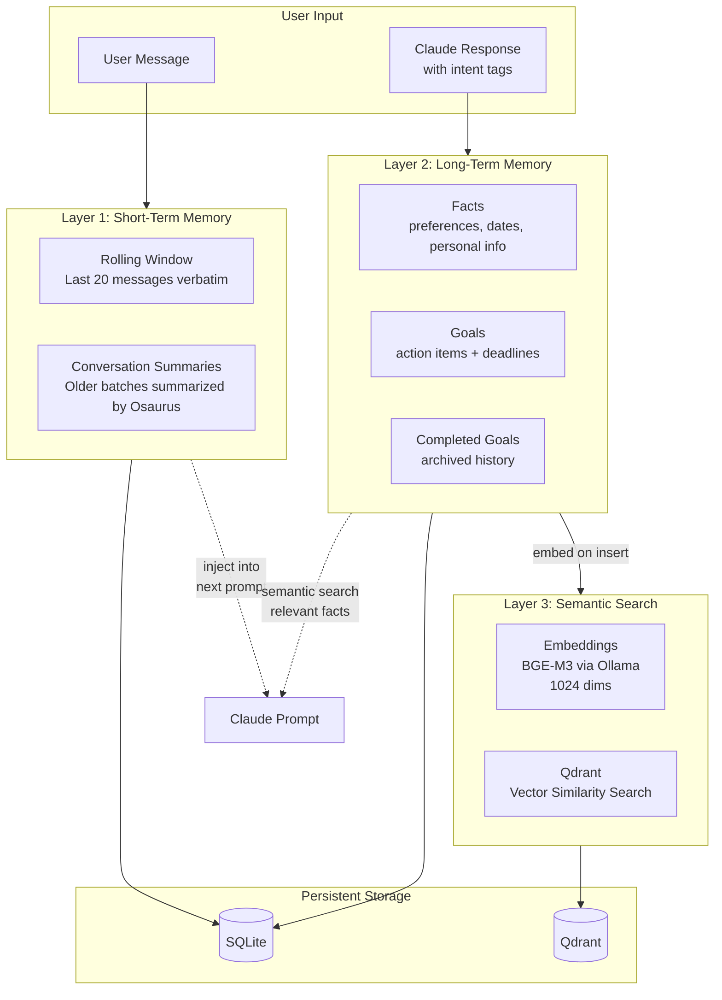
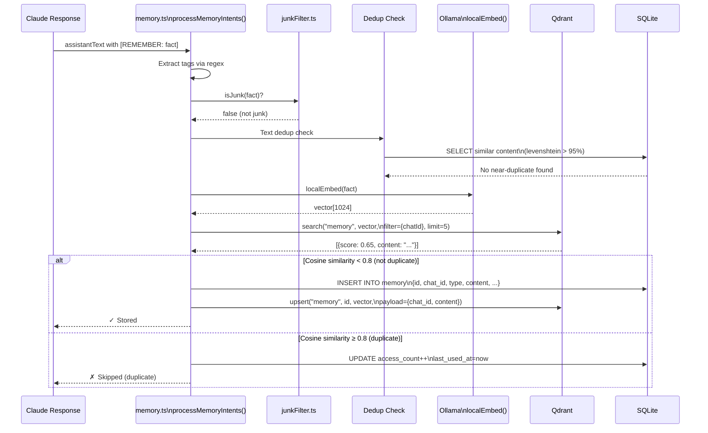
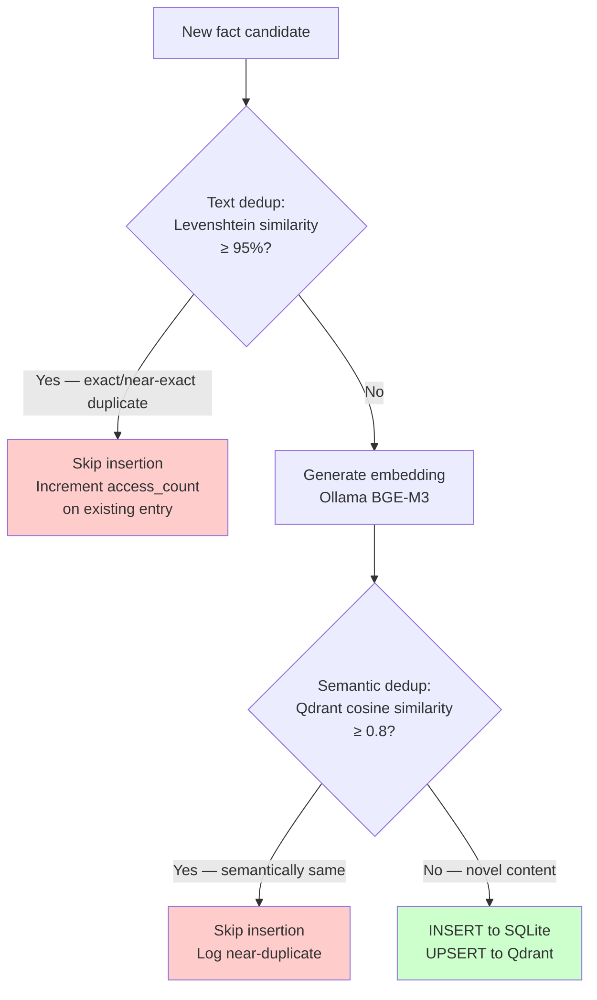
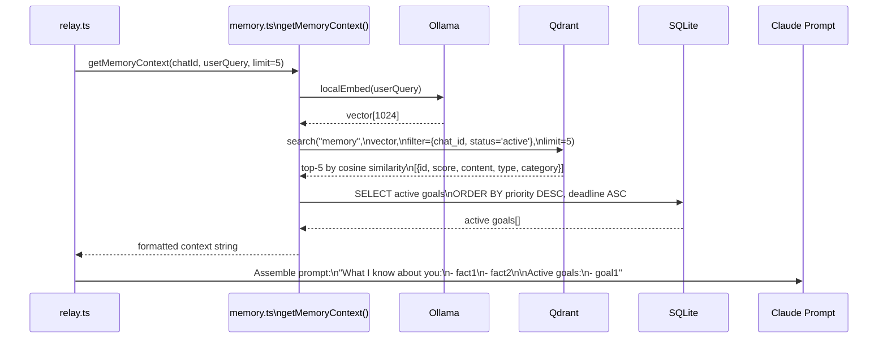
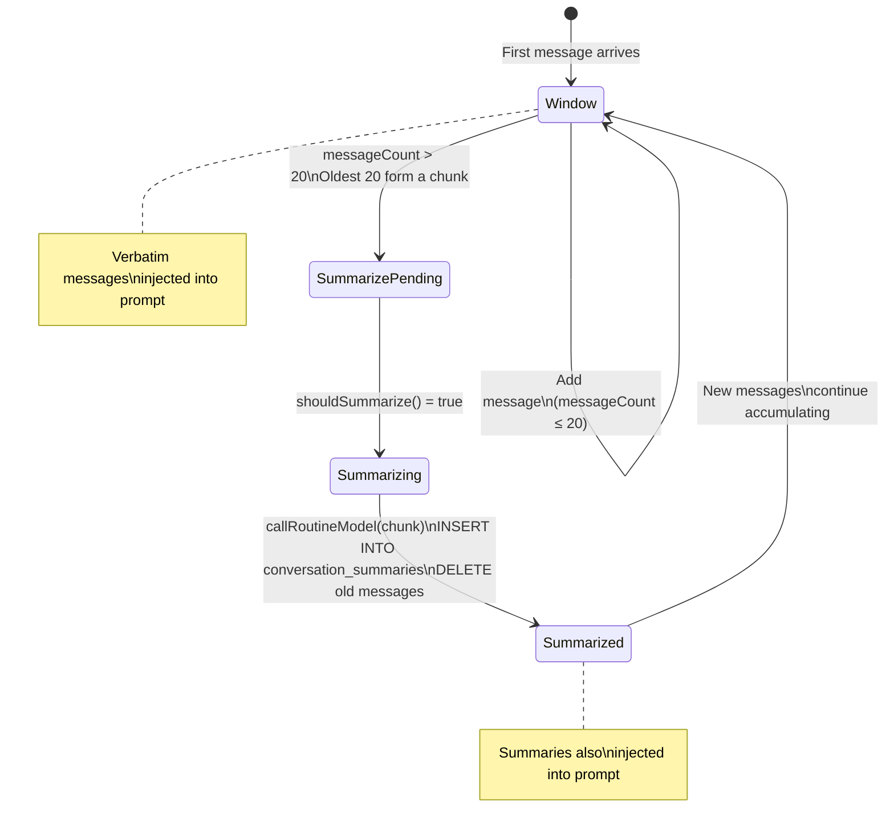
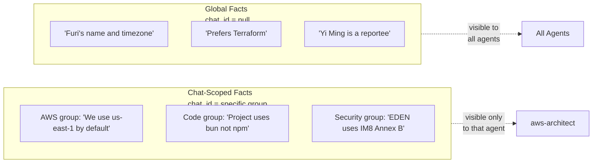
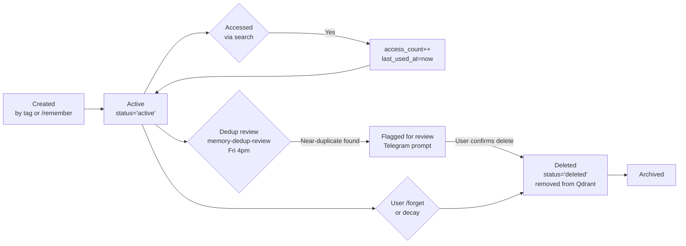
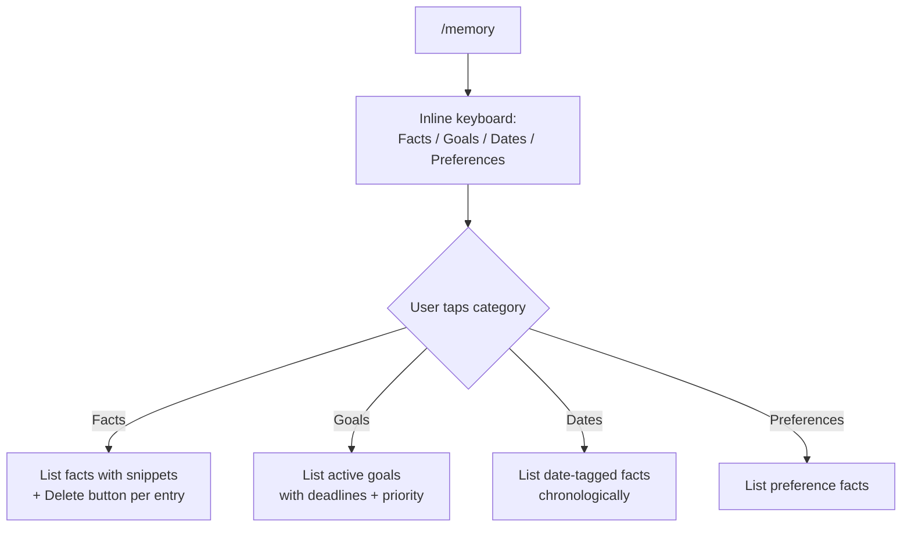

# Claude Telegram Relay — Memory System

**Version**: 1.0 | **Date**: 2026-03-21

---

## Table of Contents

1. [Overview](#overview)
2. [Three Memory Layers](#three-memory-layers)
3. [Intent Tags — How Memory Is Created](#intent-tags--how-memory-is-created)
4. [Memory Extraction Flow](#memory-extraction-flow)
5. [Duplicate Detection Algorithm](#duplicate-detection-algorithm)
6. [Memory Retrieval Flow](#memory-retrieval-flow)
7. [Short-Term Memory: Rolling Window & Summarization](#short-term-memory-rolling-window--summarization)
8. [Database Schema](#database-schema)
9. [Qdrant Collections](#qdrant-collections)
10. [Memory Categories & Types](#memory-categories--types)
11. [Memory Scoping: Chat vs Global](#memory-scoping-chat-vs-global)
12. [Memory Lifecycle](#memory-lifecycle)
13. [Interacting with Memory via Bot Commands](#interacting-with-memory-via-bot-commands)

---

## Overview

The memory system gives the relay bot persistent, personalized context that survives across sessions and days. It operates at three levels — immediate conversation context, long-term facts and goals, and semantic search — all stored locally with no cloud dependency.



---

## Three Memory Layers

| Layer | Mechanism | Storage | Retention | Purpose |
|-------|-----------|---------|-----------|---------|
| **Short-Term** | Rolling message window (last 20) | SQLite `messages` + `conversation_summaries` | Until summarised (per 20 messages) | Immediate conversation context |
| **Long-Term** | Intent tag extraction from responses | SQLite `memory` | Persistent (until `/forget` or decay) | Facts, goals, preferences |
| **Semantic Search** | BGE-M3 embeddings in Qdrant | Qdrant `memory` collection | Mirrors SQLite entries | Relevance-ranked retrieval |

---

## Intent Tags — How Memory Is Created

Claude automatically includes structured tags in its responses when it recognises something worth remembering. These tags are invisible to the user — they are stripped before the message is sent to Telegram.

### Tag Syntax

```
[REMEMBER: fact text]
→ Store as "fact", scoped to current chat

[REMEMBER_GLOBAL: fact text]
→ Store as "fact", visible to ALL agents across ALL chats

[GOAL: goal text | DEADLINE: 2026-03-31]
→ Store as "goal" with optional deadline

[DONE: search text for goal to mark completed]
→ Find matching goal, mark as completed_goal
```

### Example Conversation

```
User: I prefer Terraform for all new AWS projects.

Claude: Noted! I'll keep that in mind for all infrastructure discussions.
[REMEMBER: Furi prefers Terraform over CloudFormation for new AWS projects]
```

**What the user sees:**
```
Noted! I'll keep that in mind for all infrastructure discussions.
```

The `[REMEMBER: ...]` tag is processed and stripped automatically.

---

## Memory Extraction Flow



---

## Duplicate Detection Algorithm

Memory is checked for duplicates in two stages before insertion:



**Stage 1 — Text Similarity (fast, local):**
- Compare candidate with all existing facts for same `chat_id`
- Using Levenshtein distance normalised to [0, 1]
- Threshold: similarity ≥ 0.95 → skip

**Stage 2 — Semantic Similarity (Qdrant vector search):**
- Embed candidate with BGE-M3 (1024-dim vector)
- Search Qdrant for nearest neighbours within same `chat_id`
- Cosine similarity ≥ 0.80 → skip (semantically equivalent)
- This catches paraphrases: "Furi likes dark mode" ≈ "User prefers dark theme"

---

## Memory Retrieval Flow

Memory is retrieved on every message and injected into the Claude prompt.



**Prompt injection format:**
```
## What I Know About You
- You prefer Terraform for new AWS projects
- You work at GovTech SCTD, Cluster 8
- Yi Ming (reportee) is on leave 9–13 March 2026

## Active Goals
1. Deploy relay bot as a team template [no deadline]
2. Implement CLAUDE_MODEL_CASCADE [due: 2026-03-31]
```

---

## Short-Term Memory: Rolling Window & Summarization

Short-term memory keeps the last 20 messages verbatim, summarising older batches with Osaurus (via `callRoutineModel()`) to stay within context limits.



### Constants

| Constant | Value | Description |
|----------|-------|-------------|
| `VERBATIM_LIMIT` | 20 | Keep last N messages as full text |
| `SUMMARIZE_CHUNK_SIZE` | 20 | Summarise in N-message batches |
| `SESSION_RESUME_TTL_HOURS` | 4 | Max age for reliable `--resume` |

### Prompt Injection Format

```
## Recent Conversation
[Summary from 2026-03-18]: Discussed EDEN compliance automation, agreed on Terraform module structure...

[User, 14:22]: Can you review the latest IAM policy changes?
[Assistant, 14:23]: Looking at the changes...
[User, 14:25]: What about the S3 bucket policies?
```

---

## Database Schema

### `memory` Table

| Column | Type | Description |
|--------|------|-------------|
| `id` | TEXT PK | UUID |
| `chat_id` | TEXT | Scoped to Telegram chat (`null` = global) |
| `thread_id` | TEXT | Forum topic ID (nullable) |
| `type` | TEXT | `"fact"`, `"goal"`, `"completed_goal"` |
| `content` | TEXT | The actual memory text |
| `status` | TEXT | `"active"` or `"deleted"` |
| `source` | TEXT | `"user"` (manual) or `"llm"` (auto-extracted) |
| `category` | TEXT | `"preference"`, `"date"`, `"goal"`, `"personal"` |
| `deadline` | TEXT | ISO date string (goals only) |
| `completed_at` | TEXT | Timestamp when goal was marked done |
| `priority` | INTEGER | 0=low, 1=medium, 2=high |
| `confidence` | REAL | Dedup confidence score (0–1) |
| `importance` | REAL | Relevance weight (0–1) |
| `stability` | REAL | How stable over time (0–1) |
| `access_count` | INTEGER | Times this fact was retrieved |
| `last_used_at` | TEXT | When last retrieved via search |
| `created_at` | TEXT | Insertion timestamp |
| `updated_at` | TEXT | Last update timestamp |

### `messages` Table

| Column | Type | Description |
|--------|------|-------------|
| `id` | TEXT PK | UUID |
| `chat_id` | TEXT | Telegram chat ID |
| `thread_id` | TEXT | Forum topic ID |
| `role` | TEXT | `"user"` or `"assistant"` |
| `content` | TEXT | Full message text |
| `channel` | TEXT | `"telegram"` or `"routine"` |
| `metadata` | TEXT | JSON: `{source, routine, summary, agent_id}` |
| `agent_id` | TEXT | Which agent produced this response |
| `created_at` | TEXT | Timestamp |

### `documents` Table

| Column | Type | Description |
|--------|------|-------------|
| `id` | TEXT PK | UUID |
| `chat_id` | TEXT | Scoped to chat |
| `name` | TEXT | Document title (user-provided) |
| `source` | TEXT | File path or URL |
| `content` | TEXT | Chunk text |
| `chunk_index` | INTEGER | Position within document |
| `chunk_heading` | TEXT | Section heading (e.g., `## Deployment`) |
| `content_hash` | TEXT | SHA256 for deduplication |
| `metadata` | TEXT | JSON extra fields |
| `created_at` | TEXT | Ingest timestamp |

### `conversation_summaries` Table

| Column | Type | Description |
|--------|------|-------------|
| `id` | TEXT PK | UUID |
| `chat_id` | TEXT | Scoped to chat |
| `thread_id` | TEXT | Forum topic |
| `summary` | TEXT | Pre-summarised batch text |
| `message_count` | INTEGER | How many messages were summarised |
| `from_timestamp` | TEXT | Earliest message in batch |
| `to_timestamp` | TEXT | Latest message in batch |
| `created_at` | TEXT | When summary was created |

---

## Qdrant Collections

| Collection | Vector Dims | Distance Metric | Key Payload Fields | Purpose |
|------------|-------------|-----------------|-------------------|---------|
| `memory` | 1024 | Cosine | `chat_id`, `type`, `content`, `category`, `status` | Long-term fact + goal search |
| `messages` | 1024 | Cosine | `chat_id`, `thread_id`, `role`, `agent_id` | Conversation semantic search |
| `documents` | 1024 | Cosine | `name`, `chunk_heading`, `chat_id`, `chunk_index` | Document RAG search |
| `summaries` | 1024 | Cosine | `chat_id`, `thread_id`, `from_timestamp` | Summary search |

**Embedding model**: `bge-m3` via Ollama (`src/local/embed.ts`) — 1024-dimensional, multilingual, strong at long-context retrieval. Served on port 11434 via `/api/embed`.

---

## Memory Categories & Types

### Types

| Type | Created By | Description |
|------|-----------|-------------|
| `fact` | `[REMEMBER:]` tag or `/remember` | General knowledge about the user |
| `goal` | `[GOAL:]` tag or `/goals +` | Action item, optionally with deadline |
| `completed_goal` | `[DONE:]` tag or `/goals *N` | Archived completed goal |

### Categories (auto-detected)

| Category | Examples |
|----------|---------|
| `preference` | "Prefers dark mode", "Uses VSCode" |
| `date` | "Yi Ming on leave 9–13 March", "Meeting on Friday at 3pm" |
| `goal` | "Deploy relay bot by month end" |
| `personal` | "Furi is based in Singapore", "Works at GovTech SCTD" |

---

## Memory Scoping: Chat vs Global



- **Chat-scoped** (`[REMEMBER:]`): Stored with `chat_id`, visible only to queries from that chat
- **Global** (`[REMEMBER_GLOBAL:]`): Stored with `chat_id = null`, retrieved by all agents

---

## Memory Lifecycle



**Memory maintenance routines:**
- `memory-cleanup` (3am daily) — dedup, junk-filter, decay low-importance old facts
- `memory-dedup-review` (Fri 4pm) — semantic near-duplicate review with user confirmation

---

## Interacting with Memory via Bot Commands

### Browsing Memory



### Saving and Removing

```
/remember I prefer Terraform for all new AWS projects
→ Inserts new fact, runs dedup check

/forget Terraform preference
→ Semantic search for closest match → marks status='deleted' in SQLite → removes from Qdrant
```

### Goal Operations

```
/goals                          → List all active goals
/goals +Deploy relay bot        → Add goal (no deadline)
/goals +Fix bug | DEADLINE: 2026-03-25  → Add goal with deadline
/goals *1                       → Mark goal #1 as done
/goals *Deploy                  → Mark goal matching "Deploy" as done
/goals -outdated goal text      → Permanently remove a goal
/goals *                        → Show completed goals archive
```
