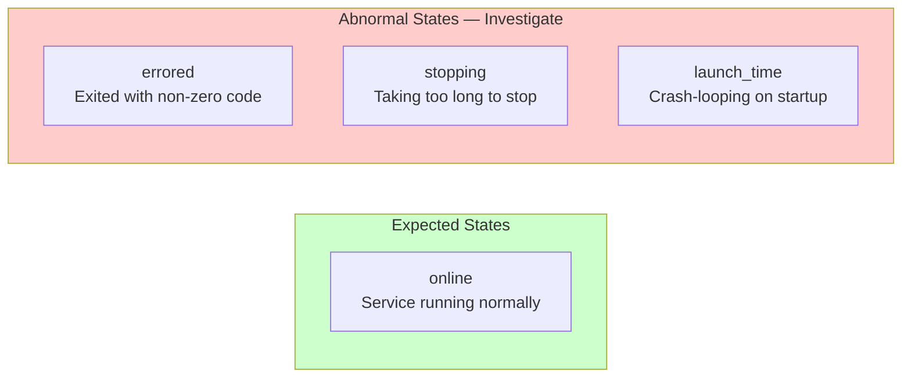
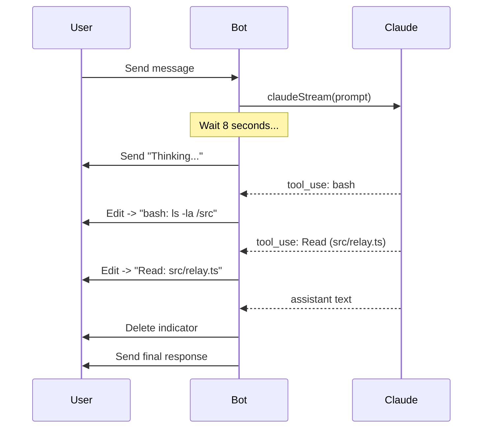
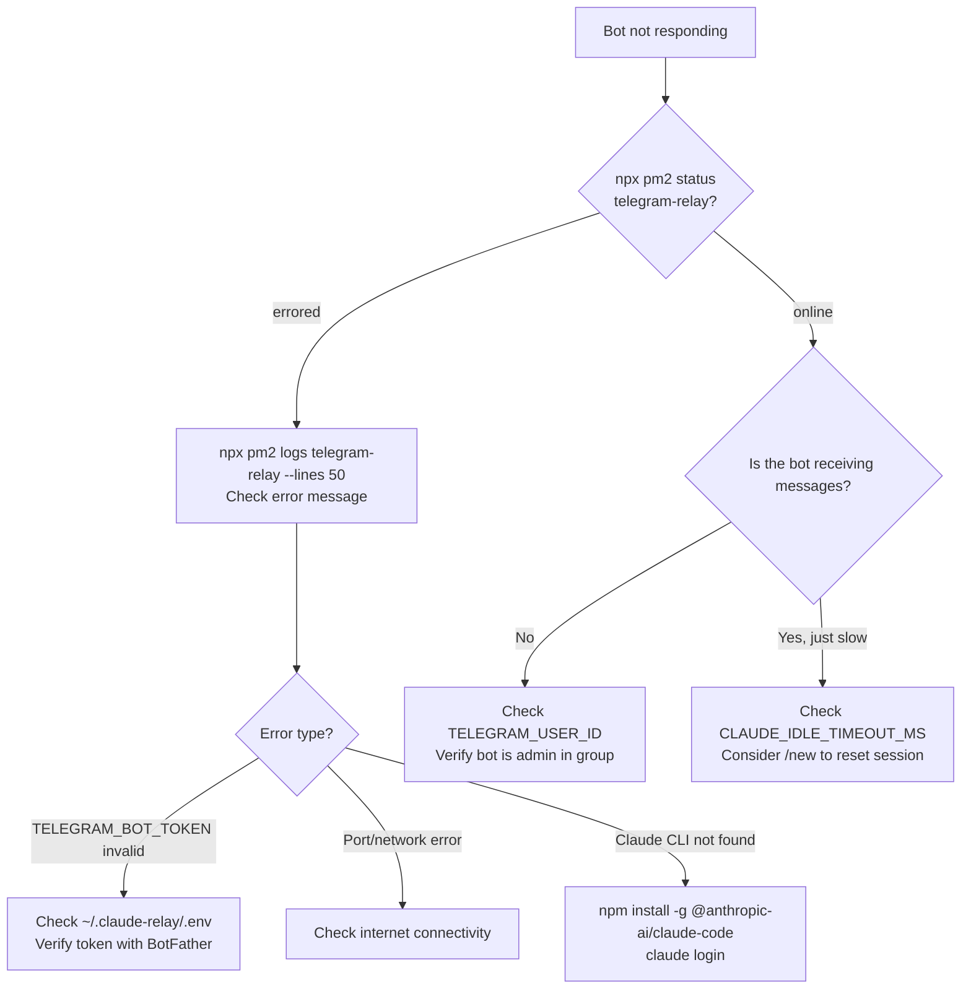
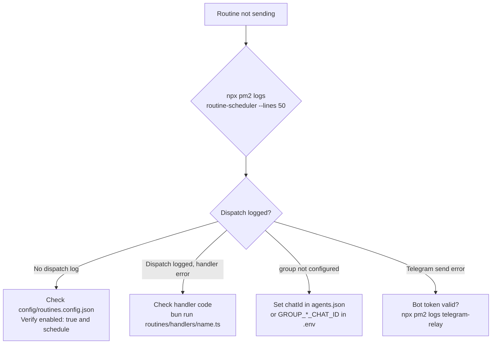
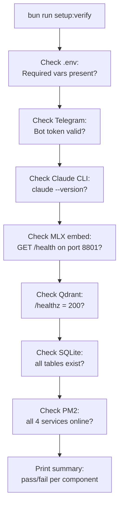

# Claude Telegram Relay — Logging, Observability & Troubleshooting

**Version**: 1.1 | **Date**: 2026-04-12

---

## Log Files

All logs are written to `~/.claude-relay/logs/`. With the 4-service PM2 architecture, each always-on service produces a log pair. Routines dispatched by `routine-scheduler` log to the scheduler's output.

```
~/.claude-relay/logs/
├── qdrant.log                  # Qdrant vector DB: stdout
├── qdrant-error.log            # Qdrant vector DB: stderr
├── mlx-embed.log               # MLX embedding server: stdout
├── mlx-embed-error.log         # MLX embedding server: stderr
├── telegram-relay.log          # Main bot: stdout (info, debug, trace)
├── telegram-relay-error.log    # Main bot: stderr (errors, stack traces)
├── routine-scheduler.log       # Scheduler: stdout (dispatches all routines)
├── routine-scheduler-error.log # Scheduler: stderr
└── YYYY-MM-DD.jsonl            # Structured observability events (when OBSERVABILITY_ENABLED=1)
```

### Key Log Commands

| Command | Description |
|---------|-------------|
| `npx pm2 logs` | Follow all services in real-time |
| `npx pm2 logs telegram-relay` | Follow main bot logs |
| `npx pm2 logs telegram-relay --lines 100` | Last 100 lines |
| `npx pm2 logs telegram-relay --nocolor` | Plain text (for grep) |
| `npx pm2 logs routine-scheduler --lines 50` | Last 50 lines of routine dispatch |
| `npx pm2 flush` | Clear all PM2 log buffers |
| `tail -f ~/.claude-relay/logs/telegram-relay.log` | Direct tail |

---

## PM2 Service Status

```bash
npx pm2 status
```

**Column Definitions:**

| Column | Description | Healthy Value |
|--------|-------------|--------------|
| `name` | Service name | -- |
| `id` | PM2 process ID | -- |
| `mode` | fork / cluster | `fork` |
| `pid` | OS process ID | non-zero |
| `uptime` | How long running | hours/days |
| `restart` | Restart count | 0 or low |
| `status` | Current state | `online` |
| `cpu` | CPU usage | < 5% idle |
| `mem` | Memory usage | < 200MB for relay |

### Expected vs Abnormal Status



### The 4 Always-On PM2 Services

All services should show `online` at all times. There are no one-shot cron jobs in PM2 — all routines are dispatched by `routine-scheduler`.

| Service | What It Does | Expected State |
|---------|-------------|----------------|
| `qdrant` | Local vector database (port 6333) | `online` (always-on) |
| `mlx-embed` | MLX bge-m3 embedding server (port 8801) | `online` (always-on) |
| `telegram-relay` | The main Telegram bot | `online` (always-on) |
| `routine-scheduler` | Reads `config/routines.config.json`, dispatches all routines on schedule via job queue webhook | `online` (always-on) |

### Routines Dispatched by routine-scheduler

All routines are defined in `config/routines.config.json` and executed by `routine-scheduler` — they do not appear as separate PM2 processes.

| Routine | Schedule | Purpose |
|---------|----------|---------|
| `morning-summary` | 7am daily | Morning briefing |
| `night-summary` | 11pm daily | Evening summary |
| `smart-checkin` | Every 30 min | Context-aware proactive check-ins |
| `watchdog` | Every 2 hours | Health monitoring and alerts |
| `orphan-gc` | Every hour | Garbage-collect orphaned resources |
| `log-cleanup` | Monday 6am | Compress and rotate old logs |
| `memory-cleanup` | 3am daily | Dedup, junk-filter, decay old facts |
| `memory-dedup-review` | Friday 4pm | Semantic near-duplicate review with user confirmation |
| `weekly-etf` | Monday 7am | Weekly ETF market summary |
| `etf-52week-screener` | Monday 7am | ETF 52-week high/low screener |
| `weekly-retro` | Sunday 9am | Weekly learning retrospective |

---

## Trace IDs

Every incoming Telegram message is assigned a **trace ID** that follows the request through all async operations. This is implemented in `src/utils/tracer.ts`.

**Log format:**
```
[trace:a3f8b2] Received message from user 123456 in chat -100987654
[trace:a3f8b2] Agent resolved: aws-architect
[trace:a3f8b2] Session loaded: sessionId=abc123 (resumable)
[trace:a3f8b2] Spawning Claude stream...
[trace:a3f8b2] Progress: Thinking...
[trace:a3f8b2] Tool use: bash -> ls -la /src
[trace:a3f8b2] Stream complete: 1,243 tokens, 8.2s
[trace:a3f8b2] Memory intent: [REMEMBER: fact extracted]
[trace:a3f8b2] Response sent to Telegram
```

**To follow a single request:**
```bash
npx pm2 logs telegram-relay --nocolor | grep "trace:a3f8b2"
```

---

## Progress Indicator

When Claude takes more than `PROGRESS_INDICATOR_DELAY_MS` (default: 8,000 ms) to respond, the bot sends a "working..." indicator and updates it with live tool activity.



**Progress prefixes:**

| Prefix | Tool / State |
|--------|-------------|
| Thinking... | Claude reasoning (no tool) |
| bash: | Shell command execution |
| Read: | File read |
| Edit: | File edit |
| Grep: | Code search |
| WebFetch: | URL fetch |
| Still working... | Long-running (> soft ceiling) |

**Configuration:**
```bash
# ~/.claude-relay/.env
PROGRESS_INDICATOR_DELAY_MS=8000   # Default: 8s before showing indicator
```

---

## CONTEXT_DEBUG Mode

Enable detailed context assembly logging:

```bash
# ~/.claude-relay/.env
CONTEXT_DEBUG=1
```

**What it logs** (to `telegram-relay.log`):
```
[context] Short-term: 18 messages verbatim + 2 summaries
[context] Memory: 5 facts retrieved (cosine > 0.6)
  - "Prefers Terraform" (score: 0.84)
  - "Yi Ming is a reportee" (score: 0.71)
[context] Documents: 3 chunks from 1 document
  - "EDEN Security Runbook / ## Deployment" (score: 0.79)
[context] Final prompt: 4,231 tokens
[context] Session: resume=abc123, reliable=true, age=1.2h
```

Disable after debugging — generates significant log volume under normal use.

---

## Health Monitoring: Watchdog

The `watchdog` routine runs every 2 hours (dispatched by `routine-scheduler`) and checks all system components. Alerts are sent to the Operations Hub group via Telegram.

| Property | Value |
|---|---|
| Script | `routines/handlers/watchdog.ts` |
| Dispatched by | `routine-scheduler` via `config/routines.config.json` |
| Schedule | Every 2 hours (`0 */2 * * *`) |
| Alert target | Operations Hub group |

### What It Monitors

**PM2 process health:** The watchdog auto-discovers all services from `ecosystem.config.cjs` at runtime. For each process it checks:

1. **Existence** — Is the process registered in PM2?
2. **Status** — Is it `online`, `stopped`, or `errored`?
3. **Restart count** — Has it exceeded the restart threshold (default: 10), indicating a crash loop?

**Bot responsiveness:** After checking PM2 processes, the watchdog probes the SQLite database to detect whether the bot is actually responding to user messages:

- Compares timestamps of the most recent user message vs. the most recent bot response
- If the gap exceeds a threshold (default: 10 minutes) and there are pending unanswered messages, it sends a responsiveness alert
- Configurable via `WATCHDOG_HEARTBEAT_THRESHOLD_MIN` env var

**Auto-restart:** Always-on processes (such as `telegram-relay`) are automatically restarted if found in a `stopped` or `errored` state. The alert notes whether the auto-restart succeeded.

### Alert Behavior

- Alerts are sent **only when problems are detected** — no noise when everything is healthy
- Each alert includes issue severity, affected service, error details, and current status of all processes
- Severity levels: **CRITICAL** (always-on process down, extreme restart count) and **WARNING** (routine errored, elevated restart count, missing process)

### Example Alerts

**Service health alert:**
```
Watchdog Alert

CRITICAL:
  [!] telegram-relay: Status: stopped (auto-restarted)

WARNINGS:
  [~] morning-summary: Last run errored — check logs

Process status:
  qdrant: online | up 2d 5h | 120.3 MB | 0 restarts
  mlx-embed: online | up 2d 5h | 450.1 MB | 0 restarts
  telegram-relay: online | up 2h 15m | 45.2 MB | 1 restarts
  routine-scheduler: online | up 2d 5h | 38.7 MB | 0 restarts

Run 'npx pm2 logs <name>' to inspect. Reply to acknowledge.
```

**Bot responsiveness alert:**
```
Bot Responsiveness Alert

Last user message: 2026-03-23T14:05:00Z
Last bot response: 2026-03-23T13:50:00Z
Gap: 15 minutes
Pending messages: 3

The bot may be stuck in a long-running session. Check PM2 logs or send /cancel.
```

### Watchdog Configuration

| Variable | Default | Purpose |
|---|---|---|
| `WATCHDOG_HEARTBEAT_THRESHOLD_MIN` | `10` | Minutes before an unanswered message triggers a responsiveness alert |

Group routing (Operations Hub chat ID and topic ID) is resolved from `config/agents.json` via the `GROUPS` registry. The watchdog exits gracefully if the Operations group is not configured.

### Watchdog Troubleshooting

**Watchdog not running:**
```bash
# Check routine-scheduler is online
npx pm2 status

# Run watchdog manually outside the scheduler
bun run routines/handlers/watchdog.ts
```

**No alerts despite known issues:**
1. Check routine-scheduler logs: `npx pm2 logs routine-scheduler --lines 50`
2. Verify the Operations Hub group is configured: ensure `chatId` is set for the operations-hub agent in `config/agents.json`
3. Run manually to see output: `bun run routines/handlers/watchdog.ts`

**False positives for cron-dispatched routines:**
Routines dispatched by `routine-scheduler` do not have their own PM2 processes, so the watchdog only monitors the 4 always-on services. For cron jobs, check `routine-scheduler` logs for dispatch errors.

**Watchdog itself fails:**
If the watchdog encounters a fatal error, it sends a failure notification to the Operations group before exiting. Check logs with:
```bash
npx pm2 logs routine-scheduler --lines 50
```

---

## Common Issues & Fixes

### Bot Not Responding



### Routine Not Sending Messages



**Quick fix for most routine issues:**
```bash
# Check routine-scheduler dispatch logs
npx pm2 logs routine-scheduler --lines 100

# Manually trigger a routine (bypass scheduler)
bun run routines/handlers/morning-summary.ts

# Restart the scheduler
npx pm2 restart routine-scheduler
```

### Session Resume Failing

**Symptoms**: Every new message starts a fresh session; Claude has no memory of conversation.

```bash
# Check session file
ls -la ~/.claude-relay/sessions/
cat ~/.claude-relay/sessions/{chatId}_null.json

# Session is stale (lastActivity > 4 hours ago)
# OR sessionId is null
```

**Fix**:
```
# In Telegram, send:
/new
```
This resets the session gracefully, and the bot will inject recent context on the next message.

**If resume keeps failing repeatedly:**
```bash
# Delete stale session file
rm ~/.claude-relay/sessions/{chatId}_null.json
# Then restart conversation
```

### Memory Not Saving

```bash
# Check Qdrant
curl http://localhost:6333/healthz
# Expected: {"title":"qdrant - vector search engine","version":"..."}

# Check MLX embed server
curl http://localhost:8801/health
# Expected: {"status":"ok","model":"...bge-m3..."}

# Check SQLite write
sqlite3 ~/.claude-relay/data/local.sqlite "SELECT count(*) FROM memory;"

# Check for embedding errors in relay logs
npx pm2 logs telegram-relay --nocolor | grep -i "embed\|mlx\|qdrant"
```

### Voice Transcription Failing

```bash
# Check VOICE_PROVIDER
grep VOICE_PROVIDER ~/.claude-relay/.env

# For Groq:
grep GROQ_API_KEY ~/.claude-relay/.env
# Verify with:
bun run test:voice

# For local Whisper:
which whisper-cpp     # must be in PATH
whisper-cpp --help    # must work
ls ~/whisper-models/  # model file must exist
```

### Document Search Returns Nothing

```bash
# Check if documents are indexed
sqlite3 ~/.claude-relay/data/local.sqlite "SELECT name, COUNT(*) FROM documents GROUP BY name;"

# Check Qdrant documents collection
curl "http://localhost:6333/collections/documents" | jq '.result.points_count'

# If 0 points but documents in SQLite -> Qdrant data was lost
# Re-ingest: upload the document again via Telegram
```

### Wrong Agent Responding

```bash
# Check routing
npx pm2 logs telegram-relay --nocolor | grep "agent\|routing\|discover"

# Check agents.json
cat config/agents.json | jq '.[].id, .[].chatId, .[].groupName'

# Force re-discovery
# Send any message in the group — auto-discovery runs on every message
```

---

## Diagnostic Commands

| Command | Purpose | Expected Output |
|---------|---------|----------------|
| `npx pm2 status` | All service states | All 4 services `online` |
| `npx pm2 logs telegram-relay --lines 50` | Recent bot activity | Message processing logs |
| `npx pm2 logs routine-scheduler --lines 30` | Recent routine dispatches | Dispatch and completion logs |
| `bun run setup:verify` | Full health check | All checks pass |
| `bun run test:telegram` | Bot connectivity | Test message sent |
| `bun run test:groups` | Group discovery | All groups found |
| `bun run test:voice` | Voice transcription | Sample transcribed |
| `bun run test:fallback` | Local AI fallback | Sample response |
| `curl http://localhost:6333/healthz` | Qdrant health | `{"title":"qdrant..."` |
| `curl http://localhost:8801/health` | MLX embed health | `{"status":"ok","model":"...bge-m3..."}` |
| `sqlite3 ~/.claude-relay/data/local.sqlite ".tables"` | DB tables exist | `documents memory messages ...` |
| `sqlite3 ~/.claude-relay/data/local.sqlite "SELECT count(*) FROM memory;"` | Memory count | number > 0 |
| `ls -la ~/.claude-relay/sessions/` | Session files | JSON files per group |
| `ls -lh ~/.claude-relay/logs/` | Log file sizes | No logs > 100MB |
| `claude --version` | Claude CLI version | Version string |

---

## Log Rotation

The `log-cleanup` routine manages log retention automatically (dispatched by `routine-scheduler`).

**Schedule**: Every Monday at 6am (`0 6 * * 1`)

**Policy:**
| Age | Action |
|-----|--------|
| < 7 days | Keep as-is |
| 7-30 days | Compress to `.gz` |
| > 30 days | Delete |

**Manual trigger:**
```bash
bun run routines/handlers/log-cleanup.ts
```

**Check log directory size:**
```bash
du -sh ~/.claude-relay/logs/
ls -lh ~/.claude-relay/logs/*.log | sort -k5 -rh | head -10
```

---

## Full Health Check

Run the built-in health check script for a comprehensive status report:

```bash
bun run setup:verify
```



**Example healthy output:**
```
Claude Telegram Relay — Health Check

[ok] .env: TELEGRAM_BOT_TOKEN, TELEGRAM_USER_ID present
[ok] Telegram: Bot connected, username @myrelaybot
[ok] Claude CLI: claude 1.x.x
[ok] MLX embed: bge-m3 available (127.0.0.1:8801)
[ok] Qdrant: healthy v1.x (127.0.0.1:6333)
[ok] SQLite: 4 tables, 342 memory entries, 1,847 messages
[ok] PM2: 4 services online (qdrant, mlx-embed, telegram-relay, routine-scheduler)

All checks passed. Bot is healthy.
```
