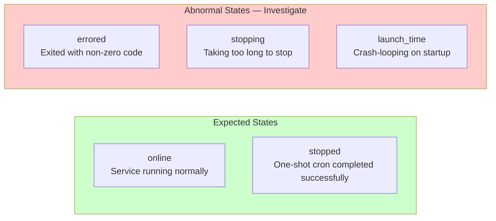
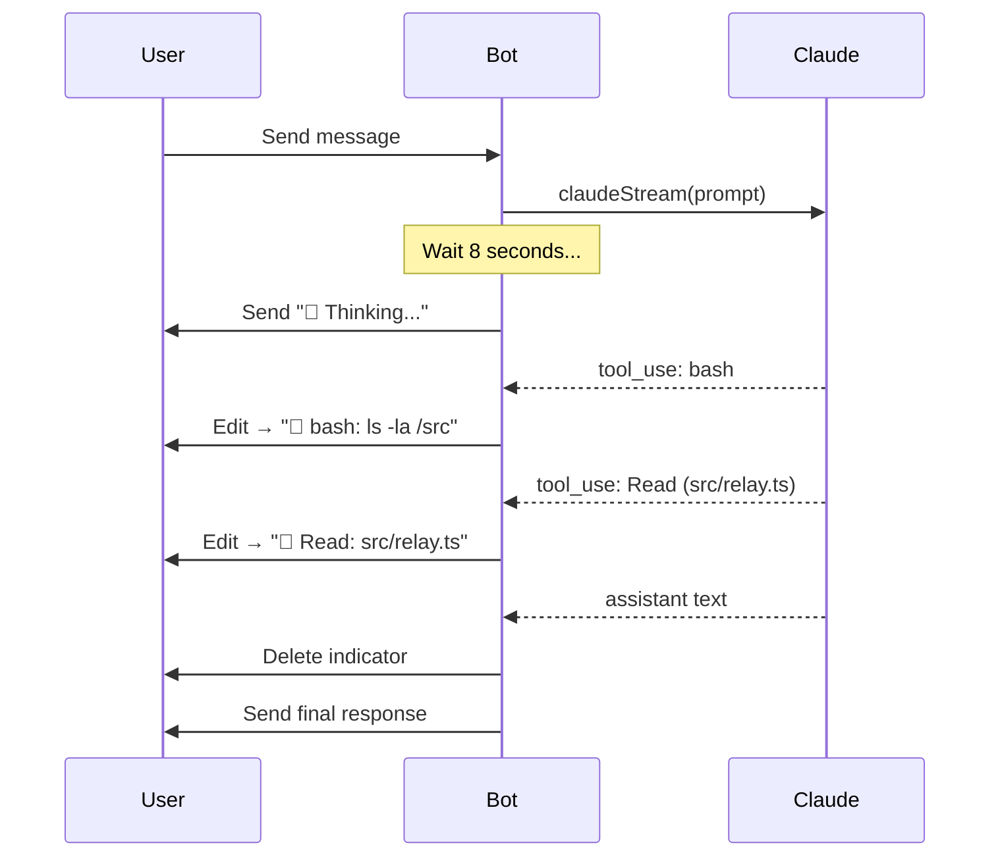
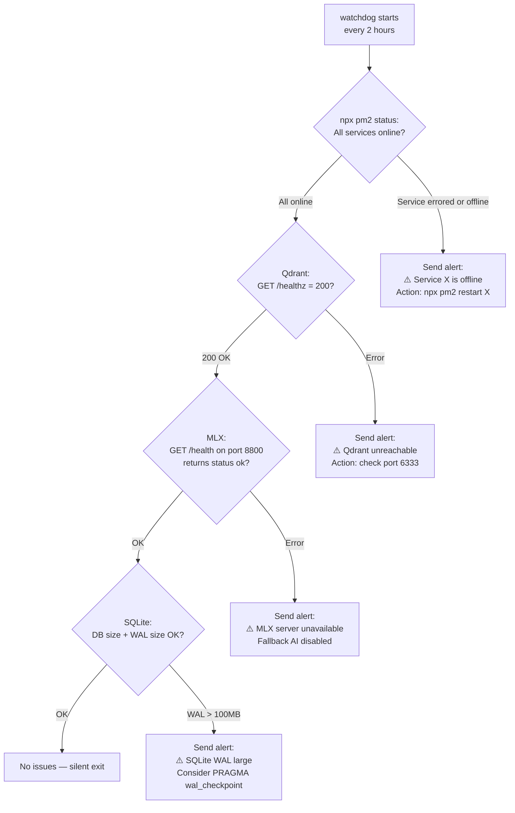
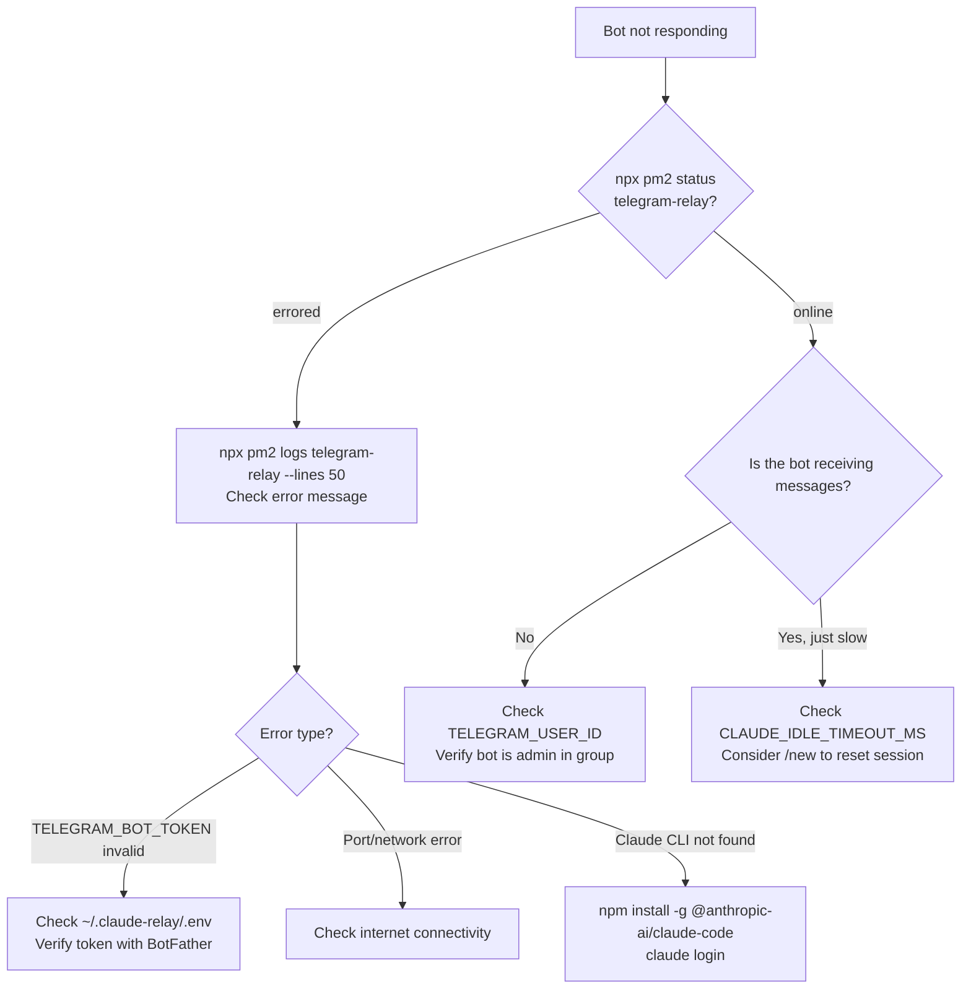
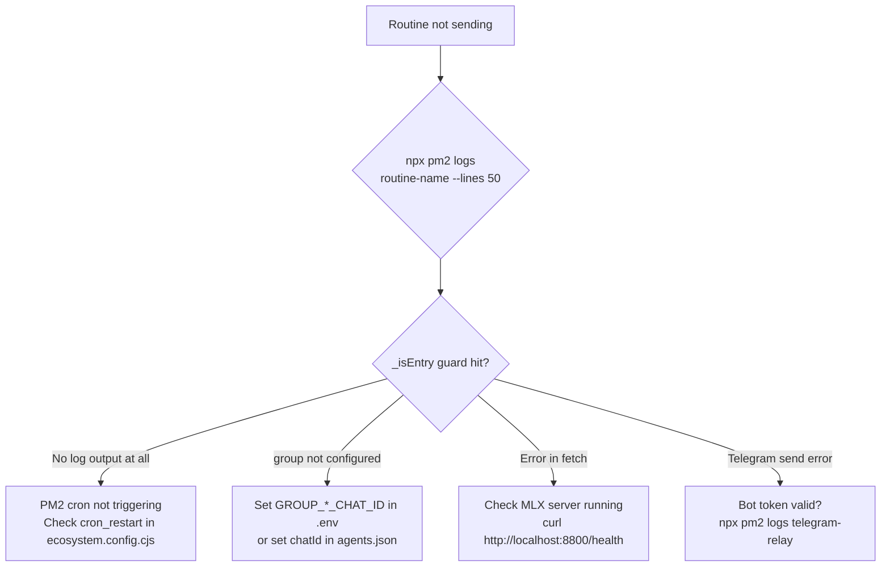
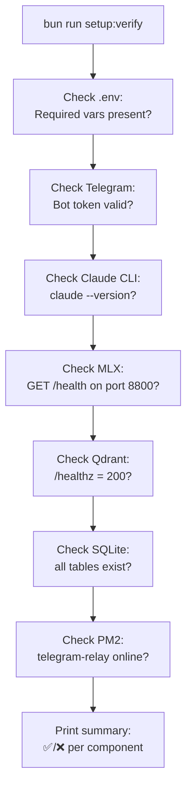

# Claude Telegram Relay — Logging, Observability & Troubleshooting

**Version**: 1.0 | **Date**: 2026-03-21

---

## Table of Contents

1. [Log Files](#log-files)
2. [PM2 Service Status](#pm2-service-status)
3. [Trace IDs](#trace-ids)
4. [Progress Indicator](#progress-indicator)
5. [CONTEXT_DEBUG Mode](#context_debug-mode)
6. [Health Monitoring: Watchdog](#health-monitoring-watchdog)
7. [Common Issues & Fixes](#common-issues--fixes)
8. [Diagnostic Commands](#diagnostic-commands)
9. [Log Rotation](#log-rotation)
10. [Full Health Check](#full-health-check)

---

## Log Files

All logs are written to `~/.claude-relay/logs/`.

```
~/.claude-relay/logs/
├── telegram-relay.log          # Main bot: stdout (info, debug, trace)
├── telegram-relay-error.log    # Main bot: stderr (errors, stack traces)
├── morning-summary.log         # Routine: stdout
├── morning-summary-error.log   # Routine: stderr
├── night-summary.log
├── night-summary-error.log
├── smart-checkin.log
├── smart-checkin-error.log
├── watchdog.log
├── watchdog-error.log
├── memory-cleanup.log
├── memory-cleanup-error.log
├── memory-dedup-review.log
├── memory-dedup-review-error.log
├── orphan-gc.log
├── orphan-gc-error.log
├── log-cleanup.log
├── weekly-etf.log
└── etf-52week-screener.log
```

### Key Log Commands

| Command | Description |
|---------|-------------|
| `npx pm2 logs` | Follow all services in real-time |
| `npx pm2 logs telegram-relay` | Follow main bot logs |
| `npx pm2 logs telegram-relay --lines 100` | Last 100 lines |
| `npx pm2 logs telegram-relay --nocolor` | Plain text (for grep) |
| `npx pm2 logs morning-summary --lines 50` | Last 50 lines of morning routine |
| `npx pm2 flush` | Clear all PM2 log buffers |
| `tail -f ~/.claude-relay/logs/telegram-relay.log` | Direct tail |

---

## PM2 Service Status

```bash
npx pm2 status
```

**Column Definitions:**

| Column | Description | Healthy Value |
|--------|-------------|--------------|
| `name` | Service name | — |
| `id` | PM2 process ID | — |
| `mode` | fork / cluster | `fork` |
| `pid` | OS process ID | non-zero |
| `uptime` | How long running | hours/days |
| `↺` | Restart count | 0 or low |
| `status` | Current state | `online` |
| `cpu` | CPU usage | < 5% idle |
| `mem` | Memory usage | < 200MB for relay |

### Expected vs Abnormal Status



**Service-specific expected states:**

| Service | Normal State Between Cron Runs |
|---------|-------------------------------|
| `qdrant` | `online` (always-on) |
| `telegram-relay` | `online` (always-on) |
| `morning-summary` | `stopped` (wakes at 7am) |
| `night-summary` | `stopped` (wakes at 11pm) |
| `smart-checkin` | `stopped` (wakes every 30min) |
| `watchdog` | `stopped` (wakes every 2hr) |
| `memory-cleanup` | `stopped` (wakes at 3am) |

---

## Trace IDs

Every incoming Telegram message is assigned a **trace ID** that follows the request through all async operations. This is implemented in `src/utils/tracer.ts`.

**Log format:**
```
[trace:a3f8b2] Received message from user 123456 in chat -100987654
[trace:a3f8b2] Agent resolved: aws-architect
[trace:a3f8b2] Session loaded: sessionId=abc123 (resumable)
[trace:a3f8b2] Spawning Claude stream...
[trace:a3f8b2] Progress: 💭 Thinking...
[trace:a3f8b2] Tool use: bash → ls -la /src
[trace:a3f8b2] Stream complete: 1,243 tokens, 8.2s
[trace:a3f8b2] Memory intent: [REMEMBER: fact extracted]
[trace:a3f8b2] Response sent to Telegram
```

**To follow a single request:**
```bash
npx pm2 logs telegram-relay --nocolor | grep "trace:a3f8b2"
```

---

## Progress Indicator

When Claude takes more than `PROGRESS_INDICATOR_DELAY_MS` (default: 8,000 ms) to respond, the bot sends a "working..." indicator and updates it with live tool activity.



**Progress prefixes:**

| Prefix | Tool / State |
|--------|-------------|
| `💭 Thinking...` | Claude reasoning (no tool) |
| `🔧 bash:` | Shell command execution |
| `📖 Read:` | File read |
| `✏️ Edit:` | File edit |
| `🔍 Grep:` | Code search |
| `🌐 WebFetch:` | URL fetch |
| `⏳ Still working...` | Long-running (> soft ceiling) |

**Configuration:**
```bash
# ~/.claude-relay/.env
PROGRESS_INDICATOR_DELAY_MS=8000   # Default: 8s before showing indicator
```

---

## CONTEXT_DEBUG Mode

Enable detailed context assembly logging:

```bash
# ~/.claude-relay/.env
CONTEXT_DEBUG=1
```

**What it logs** (to `telegram-relay.log`):
```
[context] Short-term: 18 messages verbatim + 2 summaries
[context] Memory: 5 facts retrieved (cosine > 0.6)
  - "Prefers Terraform" (score: 0.84)
  - "Yi Ming is a reportee" (score: 0.71)
[context] Documents: 3 chunks from 1 document
  - "EDEN Security Runbook / ## Deployment" (score: 0.79)
[context] Final prompt: 4,231 tokens
[context] Session: resume=abc123, reliable=true, age=1.2h
```

Disable after debugging — generates significant log volume under normal use.

---

## Health Monitoring: Watchdog

The `watchdog` routine runs every 2 hours and checks all system components.



**Alert message format:**
```
⚠️ Watchdog Alert — 2026-03-21 14:00

Services:  ✅ qdrant ✅ telegram-relay ❌ morning-summary (errored)
Qdrant:    ✅ healthy (port 6333)
MLX:       ✅ Qwen3.5-9B-MLX-4bit available (port 8800)
SQLite:    ✅ 42MB (WAL: 1.2MB)

Action needed: npx pm2 restart morning-summary
```

---

## Common Issues & Fixes

### Bot Not Responding



### Routine Not Sending Messages



**Quick fix for most routine issues:**
```bash
# Check the routine ran
npx pm2 logs morning-summary --lines 100

# Manually trigger a routine (bypass PM2 cron)
bun routines/morning-summary.ts

# Restart a specific routine
npx pm2 restart morning-summary
```

### Session Resume Failing

**Symptoms**: Every new message starts a fresh session; Claude has no memory of conversation.

```bash
# Check session file
ls -la ~/.claude-relay/sessions/
cat ~/.claude-relay/sessions/{chatId}_null.json

# Session is stale (lastActivity > 4 hours ago)
# OR sessionId is null
```

**Fix**:
```
# In Telegram, send:
/new
```
This resets the session gracefully, and the bot will inject recent context on the next message.

**If resume keeps failing repeatedly:**
```bash
# Delete stale session file
rm ~/.claude-relay/sessions/{chatId}_null.json
# Then restart conversation
```

### Memory Not Saving

```bash
# Check Qdrant
curl http://localhost:6333/healthz
# Expected: {"title":"qdrant - vector search engine","version":"...","commit":"..."}

# Check MLX server
curl http://localhost:8800/health
# Expected: {"status":"ok"}

# Check SQLite write
sqlite3 ~/.claude-relay/data/local.sqlite "SELECT count(*) FROM memory;"

# Check for MLX/embedding errors in relay logs
npx pm2 logs telegram-relay --nocolor | grep -i "embed\|mlx\|qdrant"
```

### Voice Transcription Failing

```bash
# Check VOICE_PROVIDER
grep VOICE_PROVIDER ~/.claude-relay/.env

# For Groq:
grep GROQ_API_KEY ~/.claude-relay/.env
# Verify with:
bun run test:voice

# For local Whisper:
which whisper-cpp     # must be in PATH
whisper-cpp --help    # must work
ls ~/whisper-models/  # model file must exist
```

### Document Search Returns Nothing

```bash
# Check if documents are indexed
sqlite3 ~/.claude-relay/data/local.sqlite "SELECT name, COUNT(*) FROM documents GROUP BY name;"

# Check Qdrant documents collection
curl "http://localhost:6333/collections/documents" | jq '.result.points_count'

# If 0 points but documents in SQLite → Qdrant data was lost
# Re-ingest: upload the document again via Telegram
```

### Wrong Agent Responding

```bash
# Check routing
npx pm2 logs telegram-relay --nocolor | grep "agent\|routing\|discover"

# Check agents.json
cat config/agents.json | jq '.[].id, .[].chatId, .[].groupName'

# Force re-discovery
# Send any message in the group — auto-discovery runs on every message
```

---

## Diagnostic Commands

| Command | Purpose | Expected Output |
|---------|---------|----------------|
| `npx pm2 status` | All service states | All `online` or `stopped` |
| `npx pm2 logs telegram-relay --lines 50` | Recent bot activity | Message processing logs |
| `npx pm2 logs morning-summary --lines 30` | Last routine run | Fetch + send log |
| `bun run setup:verify` | Full health check | All ✅ |
| `bun run test:telegram` | Bot connectivity | Test message sent |
| `bun run test:groups` | Group discovery | All groups found |
| `bun run test:voice` | Voice transcription | Sample transcribed |
| `bun run test:fallback` | MLX fallback | Sample response |
| `curl http://localhost:6333/healthz` | Qdrant health | `{"title":"qdrant..."` |
| `curl http://localhost:8800/health` | MLX server health | `{"status":"ok"}` |
| `sqlite3 ~/.claude-relay/data/local.sqlite ".tables"` | DB tables exist | `documents memory messages ...` |
| `sqlite3 ~/.claude-relay/data/local.sqlite "SELECT count(*) FROM memory;"` | Memory count | number > 0 |
| `ls -la ~/.claude-relay/sessions/` | Session files | JSON files per group |
| `ls -lh ~/.claude-relay/logs/` | Log file sizes | No logs > 100MB |
| `claude --version` | Claude CLI version | Version string |

---

## Log Rotation

The `log-cleanup` routine manages log retention automatically.

**Schedule**: Every Monday at 6am (`0 6 * * 1`)

**Policy:**
| Age | Action |
|-----|--------|
| < 7 days | Keep as-is |
| 7–30 days | Compress to `.gz` |
| > 30 days | Delete |

**Manual trigger:**
```bash
bun routines/log-cleanup.ts
```

**Check log directory size:**
```bash
du -sh ~/.claude-relay/logs/
ls -lh ~/.claude-relay/logs/*.log | sort -k5 -rh | head -10
```

---

## Full Health Check

Run the built-in health check script for a comprehensive status report:

```bash
bun run setup:verify
```



**Example healthy output:**
```
Claude Telegram Relay — Health Check

✅ .env: TELEGRAM_BOT_TOKEN, TELEGRAM_USER_ID present
✅ Telegram: Bot connected, username @myrelaybot
✅ Claude CLI: claude 1.x.x
✅ MLX: Qwen3.5-9B-MLX-4bit + bge-m3 available (127.0.0.1:8800)
✅ Qdrant: healthy v1.x (127.0.0.1:6333)
✅ SQLite: 4 tables, 342 memory entries, 1,847 messages
✅ PM2: telegram-relay online (uptime: 3d 14h)

All checks passed. Bot is healthy.
```
