```mermaid
block-beta
    columns 1
    A["1 · Agent system prompt (persona, instructions)"]
    B["2 · User identity + current time"]
    C["3 · ═══ USER PROFILE ═══\n(LTM: narrative profile from user_profile table)\n↳ fallback: config/profile.md"]
    D["4 · ═══ CONVERSATION HISTORY ═══\n(STM: compressed summaries + last 20 verbatim messages)"]
    E["5 · 📌 FACTS / 🎯 GOALS\n(LTM: active facts & goals from memory table)"]
    F["6 · ═══ RELEVANT CONTEXT ═══\n(LTM: semantic search — top 5 messages + top 3 memory items)"]
    G["7 · MEMORY MANAGEMENT instructions\n([REMEMBER:] [GOAL:] [DONE:] tag syntax)"]
    H["8 · User: {userMessage}"]
```

# Prompt Builder — How STM and LTM Are Injected into Claude

> Covers the full pipeline from Telegram message receipt to the assembled prompt passed to Claude CLI.
> Source files: `src/relay.ts`, `src/agents/promptBuilder.ts`, `src/memory.ts`,
> `src/memory/shortTermMemory.ts`, `src/memory/longTermExtractor.ts`.

---

## Overview

Every user message triggers four parallel memory reads. The results are assembled into a single
string (`enrichedPrompt`) that is passed as the `-p` argument to the Claude CLI subprocess.

```mermaid
flowchart TD
    TG[Telegram message received] --> AUTH[Security middleware]
    AUTH --> QUEUE[Per-chat message queue]
    QUEUE --> PMT[processTextMessage]

    PMT --> P1[getShortTermContext\nsupabase messages table]
    PMT --> P2[getUserProfile\nsupabase user_profile table]
    PMT --> P3[getRelevantContext\nSupabase semantic search]
    PMT --> P4[getMemoryContext\nsupabase memory table]

    P1 & P2 & P3 & P4 --> BUILD[buildAgentPrompt\nsrc/agents/promptBuilder.ts]
    BUILD --> PROMPT[enrichedPrompt string]
    PROMPT --> CLAUDE[callClaude -p enrichedPrompt\nClaude CLI subprocess]
    CLAUDE --> RAW[rawResponse]
    RAW --> TAGS[processMemoryIntents\nparse REMEMBER/GOAL/DONE tags]
    TAGS --> SEND[sendResponse → Telegram]
    RAW --> LTM_Q[enqueueExtraction\nasync LTM extraction]
```



---

## Prompt Assembly Order

`buildAgentPrompt` (`src/agents/promptBuilder.ts:24`) concatenates sections in this fixed order:

```
1.  agent.systemPrompt          — agent persona / instructions
2.  "You are speaking with {name}"
3.  "Current time: {timeStr}"
4.  ═══ USER PROFILE ═══         — LTM: extracted profile (or static profile.md fallback)
5.  ═══ CONVERSATION HISTORY ═══ — STM: summaries + last 20 verbatim messages
6.  📌 FACTS / 🎯 GOALS          — LTM: facts & goals from memory table
7.  ═══ RELEVANT CONTEXT ═══     — LTM: semantic search results
8.  MEMORY MANAGEMENT: ...       — instructions for [REMEMBER], [GOAL], [DONE] tags
9.  "User: {userMessage}"        — the actual message
```



---

## Short-Term Memory (STM)

**Source:** `src/memory/shortTermMemory.ts`
**Supabase tables:** `messages`, `conversation_summaries`

STM is a two-tier rolling window per `(chat_id, thread_id)`:

```mermaid
flowchart LR
    DB_MSG[(messages table\nchat_id + thread_id)] --> RECENT["getRecentMessages\nlast 20 verbatim"]
    DB_SUM[(conversation_summaries\ntable)] --> SUMS["getConversationSummaries\nall summaries, oldest first"]
    RECENT & SUMS --> FMT["formatShortTermContext\nassemble for prompt"]

    FMT --> OUT["[Summary | Feb 15–16]: ...\n[Summary | Feb 17]: ...\n\n─── Monday, 18 Feb 2026 ───\n[09:15] User: ...\n[09:17] Assistant: ..."]
```



### Summarization cycle

Triggered every 5 messages, async via `setImmediate` (never blocks response):


**Key constants** (`shortTermMemory.ts:18-19`):
| Constant | Value | Meaning |
|----------|-------|---------|
| `VERBATIM_LIMIT` | 20 | Messages kept verbatim in prompt |
| `SUMMARIZE_CHUNK_SIZE` | 20 | Messages compressed per summary |

---

## Long-Term Memory (LTM) — Three Sources

LTM has three independent read paths that run in parallel with STM fetching.

### Source 1 — User Profile (`getUserProfile`)

**File:** `src/memory/longTermExtractor.ts:375`
**Table:** `user_profile` (one row per user_id)

Contains a Claude-generated narrative summary plus structured arrays (`raw_facts`, `raw_preferences`, `raw_goals`, `raw_dates`). Rebuilt every 5 messages when new memories are inserted.

Injected under `═══ USER PROFILE ═══`. Takes precedence over static `config/profile.md`.

### Source 2 — Facts & Goals (`getMemoryContext`)

**File:** `src/memory.ts:147`
**Table:** `memory` (type IN ['fact', 'goal'], status = 'active')

```mermaid
flowchart LR
    DB[(memory table)] --> Q1["facts query\ntop 50, chat_id OR null\nordered by created_at DESC"]
    DB --> Q2["goals query\ntop 20, chat_id OR null\nordered by priority DESC"]
    Q1 & Q2 --> JUNK["junk filter\n< 4 chars or only punctuation"]
    JUNK --> FMT["📌 FACTS\n─────────────────────────\n  • user works in Singapore GovTech\n  • prefers concise responses\n\n🎯 GOALS\n─────────────────────────\n  • finish Q1 roadmap (by Mar 31)"]
```



Scope rule: `WHERE chat_id = {chatId} OR chat_id IS NULL`
— items tagged to this chat plus global items (created via `[REMEMBER_GLOBAL:]`).

### Source 3 — Semantic Search (`getRelevantContext`)

**File:** `src/memory.ts:400`
**Supabase Edge Functions:** `search` (invoked twice in parallel)

Embeds the current user message via OpenAI, then cosine-matches against stored embeddings:


Results are cached 60 seconds to avoid redundant OpenAI calls for rapid follow-up messages.

---

## LTM Write Paths — How Memories Get Created

There are two independent write paths. Both run **after** the response is sent.

```mermaid
flowchart TD
    RESP[rawResponse from Claude] --> PATH1["Path 1: Explicit tags\nprocessMemoryIntents"]
    RESP --> PATH2["Path 2: Auto-extraction\nenqueueExtraction → extractAndStore"]

    PATH1 --> T1["[REMEMBER: fact] → memory table\nchat-scoped"]
    PATH1 --> T2["[REMEMBER_GLOBAL: fact] → memory table\nchat_id = null"]
    PATH1 --> T3["[GOAL: text | DEADLINE: date] → memory table"]
    PATH1 --> T4["[DONE: search] → UPDATE completed_goal"]

    PATH2 --> LLM["extractMemoriesFromExchange\ncallClaudeText haiku\n↳ fallback: callOllamaGenerate"]
    LLM --> PARSE["parse JSON → certain / uncertain"]
    PARSE --> DEDUP["semantic duplicate check\nper item via search Edge Function"]
    DEDUP --> INSERT["INSERT memory table\nfacts, preferences, goals, dates"]
    DEDUP --> CONFIRM["uncertain items →\nsendMemoryConfirmation\n(inline Telegram buttons)"]
```



### Path 1 — Explicit Tags (synchronous, before response send)

Claude is instructed (via prompt section 7) to embed tags in its response text.
`processMemoryIntents` (`src/memory.ts:54`) strips them before sending to Telegram.

| Tag | Stored as | Scope |
|-----|-----------|-------|
| `[REMEMBER: text]` | `type=fact` | `chat_id` scoped |
| `[REMEMBER_GLOBAL: text]` | `type=fact` | `chat_id = null` (all groups) |
| `[GOAL: text \| DEADLINE: date]` | `type=goal` | `chat_id` scoped |
| `[DONE: search text]` | UPDATE → `type=completed_goal` | by content ILIKE match |

### Path 2 — Auto-Extraction (async, per-chat queue)

Runs after response is sent via `enqueueExtraction` (`src/memory/extractionQueue.ts`).
One queue per `chat_id` — ensures ordering, prevents parallel LLM calls for the same chat.


---

## Observability

With `OBSERVABILITY_ENABLED=1` in `.env`, every step above emits structured log events to
`~/.claude-relay/logs/YYYY-MM-DD.jsonl`.


Useful queries:
```bash
# Full trace for one message (follow the traceId)
jq 'select(.traceId == "TRACE-ID")' ~/.claude-relay/logs/$(date +%Y-%m-%d).jsonl

# See the prompt sent to LLM during LTM extraction
jq 'select(.type == "ltm_extraction" and .stage == "llm_call_start") | .promptSnippet' \
  ~/.claude-relay/logs/$(date +%Y-%m-%d).jsonl

# Find silent parse failures
jq 'select(.stage == "parse_error")' ~/.claude-relay/logs/$(date +%Y-%m-%d).jsonl
```

See `src/utils/tracer.ts` for the full event schema.

---

## File Map

| File | Role |
|------|------|
| `src/relay.ts` | Orchestrates all memory reads, calls `buildAgentPrompt`, calls `callClaude`, triggers write paths |
| `src/agents/promptBuilder.ts` | Assembles the final prompt string from all memory layers |
| `src/memory/shortTermMemory.ts` | STM: read (last 20 verbatim + summaries), write (Ollama summarization) |
| `src/memory/longTermExtractor.ts` | LTM auto-extraction: Claude Haiku → JSON parse → dedup → insert |
| `src/memory/extractionQueue.ts` | Per-chat serial queue for async LTM extraction |
| `src/memory/memoryConfirm.ts` | Sends Telegram inline buttons for uncertain memory items |
| `src/memory.ts` | `getMemoryContext` (facts/goals), `getRelevantContext` (semantic search), `processMemoryIntents` (tag parsing) |
| `src/utils/tracer.ts` | Observability: JSON Lines logger for all pipeline stages |
