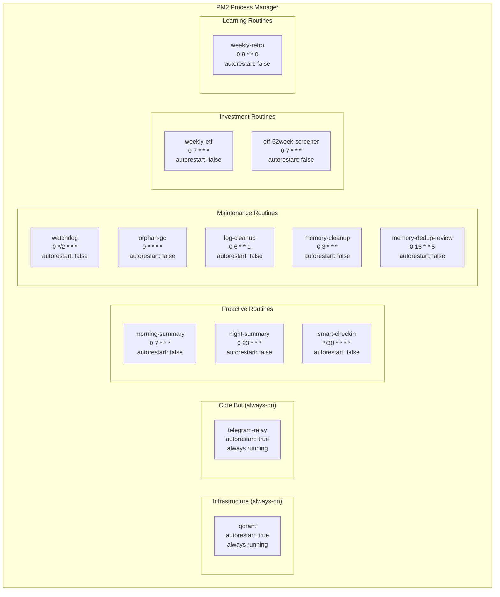
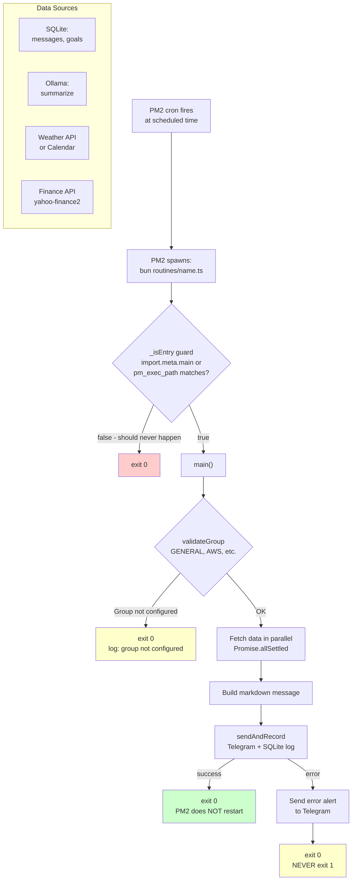
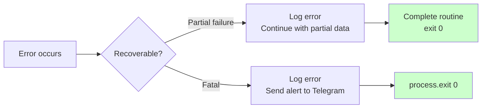
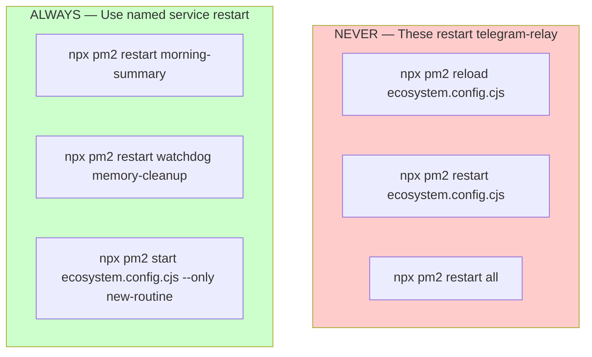

# Claude Telegram Relay — Routines System

**Version**: 1.1 | **Date**: 2026-03-28

---

## Table of Contents

1. [What Are Routines](#what-are-routines)
2. [PM2 Service Architecture](#pm2-service-architecture)
3. [Daily Schedule Timeline](#daily-schedule-timeline)
4. [Routine Lifecycle](#routine-lifecycle)
5. [Routine Descriptions](#routine-descriptions)
6. [The `_isEntry` Guard Pattern](#the-_isentry-guard-pattern)
7. [Error Handling: Always Exit 0](#error-handling-always-exit-0)
8. [PM2 Safety Rules](#pm2-safety-rules)
9. [sendAndRecord vs sendToGroup](#sendandrecord-vs-sendtogroup)
10. [Creating a New Routine](#creating-a-new-routine)
11. [Managing Routines via Telegram](#managing-routines-via-telegram)
12. [Log Files](#log-files)

---

## What Are Routines

Routines are **scheduled one-shot scripts** managed by PM2 as cron jobs. Each routine is an independent TypeScript file in `routines/` that:

1. Fires at a scheduled time (PM2 cron)
2. Fetches data (messages, goals, weather, calendar, market data)
3. Summarises or analyses with Ollama (local LLM)
4. Sends a formatted message to a Telegram group
5. **Exits cleanly** — PM2 does NOT restart it (`autorestart: false`)
6. Wakes up only at the next cron trigger

Routines are **separate from the main bot** (`telegram-relay`). They communicate via `sendAndRecord()` which writes to Telegram and logs to the `messages` SQLite table.

---

## PM2 Service Architecture



### Full Service Table

| Service | Script | Cron Schedule | autorestart | Target Group | Purpose |
|---------|--------|---------------|-------------|-------------|---------|
| `qdrant` | `~/.qdrant/bin/qdrant` | always | **true** | — | Local vector database |
| `telegram-relay` | `relay-wrapper.js` | always | **true** | — | Main bot |
| `morning-summary` | `routines/morning-summary.ts` | `0 7 * * *` | false | General | 7am daily briefing: weather, recap, goals |
| `night-summary` | `routines/night-summary.ts` | `0 23 * * *` | false | General | 11pm summary: events, unread facts |
| `smart-checkin` | `routines/smart-checkin.ts` | `*/30 * * * *` | false | General | Context-aware 30-min check-ins |
| `watchdog` | `routines/watchdog.ts` | `0 */2 * * *` | false | General | Health check: services, connectivity |
| `orphan-gc` | `routines/orphan-gc.ts` | `0 * * * *` | false | — | Cleanup orphaned sessions/temp files |
| `log-cleanup` | `routines/log-cleanup.ts` | `0 6 * * 1` | false | — | Monday 6am: rotate + compress old logs |
| `memory-cleanup` | `routines/memory-cleanup.ts` | `0 3 * * *` | false | — | 3am: dedup, junk-filter, decay old facts |
| `memory-dedup-review` | `routines/memory-dedup-review.ts` | `0 16 * * 5` | false | General | Friday 4pm: semantic dedup with user review |
| `weekly-etf` | `routines/weekly-etf.ts` | `0 7 * * *` | false | General | Daily 7am: ETF performance screening |
| `etf-52week-screener` | `routines/etf-52week-screener.ts` | `0 7 * * *` | false | General | Daily 7am: 52-week high/low screener |
| `weekly-retro` | `routines/weekly-retro.ts` | `0 9 * * 0` | false | General | Sunday 9am: learning retro with Promote/Reject/Later |

---

## Daily Schedule Timeline

```mermaid
gantt
    title Daily Routine Schedule (SGT)
    dateFormat HH:mm
    axisFormat %H:%M

    section Infrastructure
    qdrant (always-on)       :active, 00:00, 24h
    telegram-relay (always-on) :active, 00:00, 24h

    section Night
    night-summary             :crit, 23:00, 5m

    section Morning
    morning-summary           :done, 07:00, 5m
    weekly-etf                :done, 07:01, 5m
    etf-52week-screener       :done, 07:02, 5m

    section Check-ins (every 30 min, waking hours)
    smart-checkin 08:00       :active, 08:00, 2m
    smart-checkin 08:30       :active, 08:30, 2m
    smart-checkin 09:00       :active, 09:00, 2m
    smart-checkin 14:00       :active, 14:00, 2m
    smart-checkin 20:00       :active, 20:00, 2m

    section Maintenance (background)
    memory-cleanup            :00:00, 5m
    orphan-gc (hourly)        :01:00, 2m
    watchdog (every 2hr)      :02:00, 3m
    log-cleanup (Mon 6am)     :06:00, 5m
    memory-dedup-review (Fri 4pm) :16:00, 10m

    section Learning (weekly)
    weekly-retro (Sun 9am)    :09:00, 5m
```



---

## Routine Lifecycle



---

## Routine Descriptions

### `morning-summary` — Daily 7am Briefing

**Schedule**: `0 7 * * *`
**Target**: General AI Assistant group

Sends a structured morning briefing with:
- **Weather** (Open-Meteo + NEA Singapore for configured areas)
- **Yesterday recap** — Ollama-summarised messages from last 24h
- **Active goals** with deadlines
- **Calendar events** for today (via macOS Calendar integration)
- **Suggested focus** based on goals and recent context

---

### `night-summary` — Daily 11pm Summary

**Schedule**: `0 23 * * *`
**Target**: General AI Assistant group

Sends an evening review:
- Messages and decisions from today
- Unreviewed or new facts extracted today
- Upcoming deadlines in the next 7 days
- **Learnings Captured Today** — runs correction detection on today's sessions and appends any captured learning patterns

---

### `smart-checkin` — 30-Minute Proactive Check-ins

**Schedule**: `*/30 * * * *`
**Target**: General AI Assistant group

Context-aware check-in that only sends if there's something meaningful to surface:
- Upcoming deadline warnings
- Pending goals with no recent activity
- Relevant news or alerts
- **Silent** if nothing meaningful to surface (does NOT spam empty messages)

---

### `watchdog` — Health Monitor

**Schedule**: `0 */2 * * *` (every 2 hours)
**Target**: General AI Assistant group

Checks system health:
- PM2 service status (all services)
- Qdrant connectivity (`GET /healthz`)
- Ollama availability
- SQLite DB size and WAL status
- Sends alert if any service is down or degraded

---

### `orphan-gc` — Hourly Cleanup

**Schedule**: `0 * * * *`
**Target**: Silent (no Telegram message)

Maintenance task:
- Remove orphaned Claude session files (> 24h old, no matching PM2 process)
- Clean up `/tmp/` files created by vision/voice processing

---

### `log-cleanup` — Weekly Log Rotation

**Schedule**: `0 6 * * 1` (Monday 6am)
**Target**: Silent

- Compress logs older than 7 days to `.gz`
- Delete logs older than 30 days
- Report log directory size

---

### `memory-cleanup` — Daily Memory Maintenance

**Schedule**: `0 3 * * *`
**Target**: Silent

- Run junk filter on recently added facts (remove low-value entries)
- Text dedup pass across all active memories
- Decay `importance` score for very old, never-accessed facts

---

### `memory-dedup-review` — Weekly Semantic Dedup Review

**Schedule**: `0 16 * * 5` (Friday 4pm)
**Target**: General AI Assistant group

- Semantic similarity scan across all memory entries
- Groups near-duplicate facts (cosine ≥ 0.85)
- Sends Telegram message listing clusters with inline "Delete" buttons
- User reviews and confirms deletions interactively

---

### `weekly-retro` — Weekly Learning Retrospective

**Schedule**: `0 9 * * 0` (Sunday 9am SGT)
**Target**: General AI Assistant group

Surfaces high-confidence learnings for human-gated promotion to `~/.claude/CLAUDE.md`:
- Queries learning candidates: `type='learning'`, confidence ≥ 0.70, age ≥ 3 days
- Sends one Telegram message per candidate with **Promote / Reject / Later** inline keyboard
- **Promote** → appends rule to the "Learned Preferences" section in `~/.claude/CLAUDE.md`
- **Reject** → confidence -0.2 (deprioritises for future retros)
- **Later** → deferred to next Sunday

Also sends a weekly stats header: total learnings this week, correction-derived count, total promoted rules.

---

### `weekly-etf` / `etf-52week-screener` — Investment Routines

**Schedule**: `0 7 * * *`
**Target**: General AI Assistant group

- Fetch ETF price data via `yahoo-finance2`
- Screen for significant moves, new highs/lows
- Send formatted summary with percentage changes

---

## The `_isEntry` Guard Pattern

### The Problem: `import.meta.main` is `false` Under PM2

PM2's Bun process container (`ProcessContainerForkBun.js`) uses `require()` to load scripts:
```javascript
require(process.env.pm_exec_path)
```

When Bun `require()`s a module, `import.meta.main` is **always `false`**. If routines used the standard guard:
```typescript
if (import.meta.main) { main() }  // ← NEVER runs under PM2
```

**Result**: `main()` is never called. PM2 starts the process, it loads, does nothing, exits 0, PM2 marks it as online, cron never triggers a real run.

### The Fix: `_isEntry` Guard

All routines use this pattern instead:

```typescript
const _isEntry =
  import.meta.main ||
  process.env.pm_exec_path === import.meta.url?.replace("file://", "");

if (_isEntry) {
  main().catch((error) => {
    console.error("Error running routine:", error);
    process.exit(0); // exit 0 so PM2 does not immediately restart
  });
}
```

**Why this works**: `process.env.pm_exec_path` is set by PM2 to the full path of the script being run. `import.meta.url` is the current module's file URL. Stripping `file://` and comparing them correctly identifies PM2-launched execution.

---

## Error Handling: Always Exit 0



**Rule**: Routines **always** call `process.exit(0)` on completion, success or failure.

**Why**: `autorestart: false` means PM2 will not restart a routine that exits normally (exit 0). If a routine exits with code 1 (failure), PM2 may restart it, causing a restart loop.

**Pattern for error handling:**
```typescript
async function main() {
  try {
    const [messages, weather] = await Promise.allSettled([
      getMessages(chatId),
      getWeather(areas),
    ]);
    // Handle partial failures from allSettled
    const message = buildMessage({ messages: messages.value, weather: weather.value });
    await sendAndRecord(chatId, message, { routineName: "morning-summary" });
  } catch (error) {
    console.error("[morning-summary] Fatal error:", error);
    // Try to send alert, but don't let send failure cascade
    try {
      await sendToGroup(chatId, `⚠️ morning-summary failed: ${error.message}`);
    } catch {}
  }
}
// Always exit 0
process.exit(0);
```

---

## PM2 Safety Rules

> These rules prevent accidental outages of the main `telegram-relay` service.



**Critical rule**: Never run `npx pm2 reload ecosystem.config.cjs` or `npx pm2 restart ecosystem.config.cjs`. These restart ALL services including `telegram-relay`, causing the main bot to go offline and potentially enter a restart loop.

**Adding a new routine**: Do NOT reload the whole ecosystem. Use:
```bash
npx pm2 start ecosystem.config.cjs --only my-new-routine
npx pm2 save
```

---

## sendAndRecord vs sendToGroup

| Function | Use For | Writes to SQLite? | Use Case |
|----------|---------|-------------------|----------|
| `sendAndRecord()` | User-facing routine messages | Yes (channel='routine') | morning-summary, night-summary, check-ins |
| `sendToGroup()` | Error alerts, debug messages | No | watchdog alerts, error notifications |

**Import**:
```typescript
import { sendAndRecord } from "../src/utils/routineMessage.ts";
import { sendToGroup } from "../src/utils/sendToGroup.ts";
```

**`sendAndRecord` signature**:
```typescript
sendAndRecord(chatId: number, message: string, options: {
  routineName: string;
  agentId: string;
  topicId?: number | null;
  parseMode?: "HTML" | "MarkdownV2";
}): Promise<void>
```

---

## Creating a New Routine

### Step 1: Create the Routine File

```typescript
#!/usr/bin/env bun
/**
 * @routine my-routine
 * @description What this routine does
 * @schedule 0 8 * * 1    ← Every Monday 8am
 * @target General AI Assistant
 */

import { sendAndRecord } from "../src/utils/routineMessage.ts";
import { GROUPS, validateGroup } from "../src/config/groups.ts";

async function main() {
  if (!validateGroup("GENERAL")) {
    console.error("[my-routine] GENERAL group not configured — skipping");
    return;
  }

  let message: string;

  try {
    // Fetch data
    const data = await fetchSomeData();

    // Build message
    message = `📊 <b>Weekly Report</b>\n\n${data}`;
  } catch (error) {
    console.error("[my-routine] Error:", error);
    try {
      await sendAndRecord(GROUPS.GENERAL.chatId, `⚠️ my-routine failed: ${error.message}`, {
        routineName: "my-routine",
        agentId: "general-assistant",
        topicId: GROUPS.GENERAL.topicId,
      });
    } catch {}
    return;
  }

  await sendAndRecord(GROUPS.GENERAL.chatId, message, {
    routineName: "my-routine",
    agentId: "general-assistant",
    topicId: GROUPS.GENERAL.topicId,
  });
}

// _isEntry guard — required for PM2 + bun compatibility
const _isEntry =
  import.meta.main ||
  process.env.pm_exec_path === import.meta.url?.replace("file://", "");

if (_isEntry) {
  main().catch((error) => {
    console.error("[my-routine] Unhandled error:", error);
    process.exit(0);
  });
}
```

### Step 2: Add to ecosystem.config.cjs

```javascript
{
  name: "my-routine",
  script: "routines/my-routine.ts",
  interpreter: "bun",
  cron_restart: "0 8 * * 1",   // Every Monday 8am
  autorestart: false,
  watch: false,
  env: { NODE_ENV: "production" },
},
```

### Step 3: Start the Routine

```bash
# Start ONLY this routine — never reload whole ecosystem
npx pm2 start ecosystem.config.cjs --only my-routine
npx pm2 save    # Persist to startup

# Verify
npx pm2 status my-routine
```

### Step 4: Test Manually

```bash
bun routines/my-routine.ts
```

---

## Managing Routines via Telegram

Send `/routines` to the bot to get an interactive routine management panel:

```
📅 Routine Status

✅ morning-summary     online  │  Last: 07:00
✅ night-summary       online  │  Last: 23:00
✅ smart-checkin       online  │  Last: 14:30
✅ watchdog            online  │  Last: 12:00
⚠️ memory-cleanup     errored │  Last: 03:00 (exit 1)

[Restart errored]   [View logs]   [Refresh]
```

---

## Log Files

All PM2 logs are written to `~/.claude-relay/logs/`:

| File | Content |
|------|---------|
| `telegram-relay.log` | Main bot stdout |
| `telegram-relay-error.log` | Main bot stderr |
| `morning-summary.log` | Morning routine stdout |
| `morning-summary-error.log` | Morning routine stderr |
| `{service}.log` | Per-service stdout |
| `{service}-error.log` | Per-service stderr |

**View logs:**
```bash
# Tail a specific routine
npx pm2 logs morning-summary --lines 50 --nocolor

# Follow in real-time
npx pm2 logs morning-summary

# View all services
npx pm2 logs
```

**Log rotation**: `log-cleanup` runs every Monday 6am, compresses logs older than 7 days, deletes logs older than 30 days.
