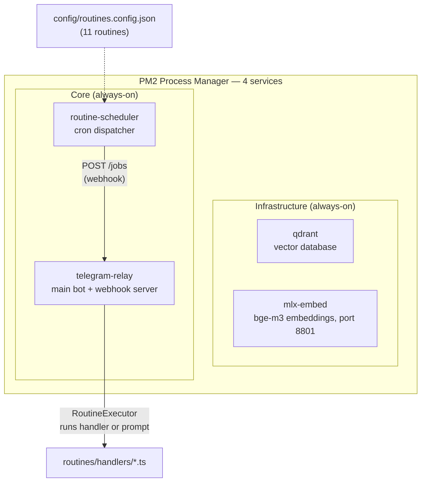
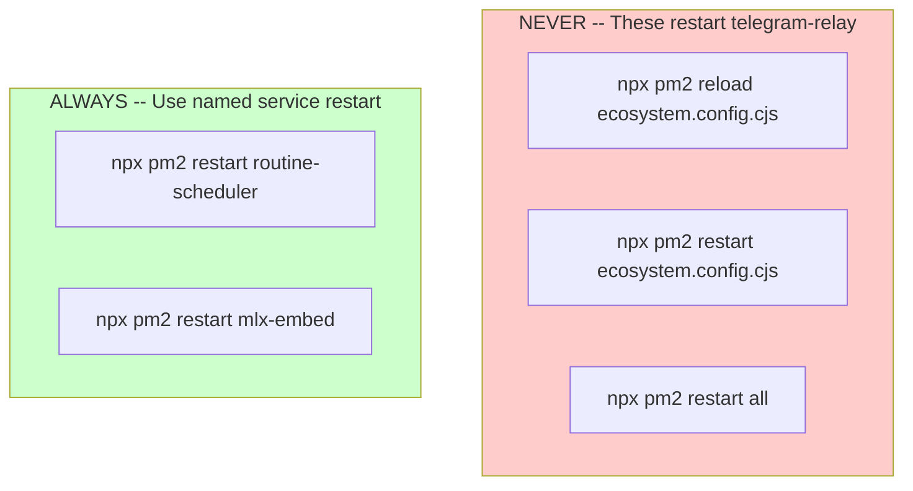

# Routines System

**Version**: 2.0 | **Date**: 2026-04-12

---

## Overview

A routine is a scheduled task that runs automatically at a fixed time and sends its output to a Telegram chat or group. There are two types:

**Handler-type routines** are TypeScript modules in `routines/handlers/<name>.ts` that export a `run(ctx: RoutineContext)` function. They can fetch data from APIs, query databases, run conditional logic, and format custom messages. Use these when the task needs real data.

**Prompt-type routines** require zero code. Add an entry to `config/routines.config.json` with `"type": "prompt"` and a `"prompt"` field. When the routine fires, the system sends the prompt to the LLM and posts the response to Telegram. Use these for simple scheduled AI tasks like daily reminders or goal reviews.

| Situation | Type |
|---|---|
| "Summarise my daily activity at 9pm" | Prompt |
| "Remind me every morning to review my goals" | Prompt |
| "Pull AWS Cost Explorer data and analyse it" | Handler |
| "Run a security vulnerability scan daily" | Handler |
| "Post my ETF portfolio every Friday" | Handler |

---

## Architecture

The system runs on 4 PM2 services. Per-routine PM2 entries no longer exist.



**How it works:**

1. `routine-scheduler` reads `config/routines.config.json` at startup and registers one cron job per entry.
2. On each cron trigger, the scheduler fires a `POST /jobs` webhook to the relay (using `JOBS_WEBHOOK_PORT` and `JOBS_WEBHOOK_SECRET`).
3. The relay enqueues the job. `RoutineExecutor` picks it up:
   - **Handler-type**: loads `routines/handlers/<name>.ts` and calls `run(ctx)` with an injected `RoutineContext`.
   - **Prompt-type**: sends `payload.prompt` to the LLM and posts the result to Telegram. No handler file needed.
4. Handler modules are cached after first load. Send `SIGUSR2` to `routine-scheduler` to hot-reload handlers without a full restart.

---

## Routine Config

All routines are defined in `config/routines.config.json`. User overrides in `~/.claude-relay/routines.config.json` are merged on top at startup.

### Schema

```json
{
  "name": "my-routine",
  "type": "handler",
  "schedule": "0 9 * * *",
  "group": "OPERATIONS",
  "enabled": true,
  "priority": "background"
}
```

| Field | Required | Description |
|---|---|---|
| `name` | Yes | Kebab-case identifier. Must match the handler filename for handler-type routines. |
| `type` | Yes | `"handler"` (TypeScript module) or `"prompt"` (LLM-only). |
| `schedule` | Yes | Cron expression (5 fields, local system time). |
| `group` | Yes | Target Telegram group key from `config/agents.json` (e.g. `OPERATIONS`). |
| `enabled` | No | Default `true`. Set `false` to disable without removing the entry. |
| `priority` | No | Job priority: `"urgent"`, `"normal"` (default), or `"background"`. |
| `prompt` | Prompt-type only | The prompt text sent to the LLM when the routine fires. |

### The 11 Built-in Routines

| Routine | Type | Schedule | Group | Purpose |
|---|---|---|---|---|
| `morning-summary` | handler | `0 7 * * *` | OPERATIONS | 7am daily briefing: weather, recap, goals, calendar |
| `night-summary` | handler | `0 23 * * *` | OPERATIONS | 11pm summary: events, unread facts, upcoming deadlines |
| `smart-checkin` | handler | `*/30 * * * *` | OPERATIONS | Context-aware 30-min check-ins (silent if nothing to surface) |
| `watchdog` | handler | `0 */2 * * *` | OPERATIONS | Health check: PM2 services, Qdrant, SQLite, model servers |
| `orphan-gc` | handler | `0 * * * *` | OPERATIONS | Hourly cleanup of orphaned sessions and temp files |
| `log-cleanup` | handler | `0 6 * * 1` | OPERATIONS | Monday 6am: compress old logs, delete logs > 30 days |
| `memory-cleanup` | handler | `0 3 * * *` | OPERATIONS | 3am: dedup, junk-filter, decay stale facts |
| `memory-dedup-review` | handler | `0 16 * * 5` | OPERATIONS | Friday 4pm: semantic dedup with interactive Telegram review |
| `weekly-etf` | handler | `0 7 * * 1` | OPERATIONS | Monday 7am: ETF performance screening |
| `etf-52week-screener` | handler | `0 7 * * 1` | OPERATIONS | Monday 7am: 52-week high/low screener |
| `weekly-retro` | handler | `0 9 * * 0` | OPERATIONS | Sunday 9am: learning retrospective with Promote/Reject/Later |

### Daily Schedule Timeline

```mermaid
gantt
    title Daily Routine Schedule (SGT)
    dateFormat HH:mm
    axisFormat %H:%M

    section Always-on
    qdrant + mlx-embed        :active, 00:00, 24h
    telegram-relay            :active, 00:00, 24h
    routine-scheduler         :active, 00:00, 24h

    section Night
    night-summary             :crit, 23:00, 5m

    section Morning
    morning-summary           :done, 07:00, 5m

    section Check-ins (every 30 min, waking hours)
    smart-checkin samples     :active, 08:00, 2m

    section Maintenance (background)
    memory-cleanup            :00:00, 5m
    orphan-gc (hourly)        :01:00, 2m
    watchdog (every 2hr)      :02:00, 3m
    log-cleanup (Mon 6am)     :06:00, 5m

    section Weekly
    weekly-etf (Mon 7am)      :07:01, 5m
    etf-52week-screener (Mon) :07:02, 5m
    memory-dedup-review (Fri) :16:00, 10m
    weekly-retro (Sun 9am)    :09:00, 5m
```



---

## Creating a New Routine

### Handler-type (TypeScript logic)

**Step 1** -- Create `routines/handlers/<name>.ts`:

```typescript
import type { RoutineContext } from "../../src/jobs/executors/routineContext.ts";

export async function run(ctx: RoutineContext): Promise<void> {
  await ctx.skipIfRanWithin(6); // optional: skip if ran in last 6 hours

  const data = await fetchSomeData();
  const result = await ctx.llm(`Summarise this data:\n${data}`);
  await ctx.send(result);
  ctx.log("my-routine complete");
}
```

No `_isEntry` guard, no `loadEnv`, no `process.exit` -- the scheduler owns all lifecycle boilerplate.

**Step 2** -- Add to `config/routines.config.json`:

```json
{
  "name": "my-routine",
  "type": "handler",
  "schedule": "0 9 * * *",
  "group": "OPERATIONS",
  "enabled": true
}
```

**Step 3** -- Restart the scheduler (only):

```bash
npx pm2 restart routine-scheduler
npx pm2 save
```

No `ecosystem.config.cjs` edit needed.

**Step 4** -- Test manually:

The handler is a pure module, so you cannot run it directly with `bun`. Instead, trigger it via the CLI:

```bash
bun run relay:jobs run --type routine --executor my-routine
```

### Prompt-type (zero code, via config)

Add to `config/routines.config.json`:

```json
{
  "name": "daily-goals-review",
  "type": "prompt",
  "schedule": "0 9 * * *",
  "group": "OPERATIONS",
  "prompt": "Review my active goals. Be concise, highlight urgent items, suggest one priority action for today."
}
```

Restart the scheduler: `npx pm2 restart routine-scheduler`. No handler file needed.

### Prompt-type (via Telegram -- conversational)

You can also create prompt-type routines through natural language in Telegram:

1. Send a message like: *"Create a daily routine at 9am that summarizes my goals for the week"*
2. The bot extracts name, schedule, and prompt, then shows a preview with target selection buttons.
3. Tap a target (Personal chat, Operations group, etc.) to confirm.
4. The routine is added to config and starts immediately.

---

## RoutineContext API

`RoutineContext` is injected into every handler by `RoutineExecutor`. Import the type from `src/jobs/executors/routineContext.ts`.

| Method | Signature | Description |
|---|---|---|
| `send` | `(message: string) => Promise<void>` | Send a message to the routine's configured Telegram group and record it in the database. |
| `llm` | `(prompt: string, opts?: LlmOpts) => Promise<string>` | Call the LLM via the ModelRegistry `routine` slot (cascade: Claude -> local model). |
| `log` | `(message: string) => void` | Write a log line tagged with the routine name. |
| `skipIfRanWithin` | `(hours: number) => Promise<void>` | Throw `SkipError` (job marked `skipped`) if this routine ran successfully within the last N hours. |

For developer patterns, testing conventions, and advanced topics (data fetching, parse modes, group resolution), see `routines/CLAUDE.md`.

---

## Managing Routines via Telegram

All management happens through the `/routines` command.

| Command | What it does |
|---|---|
| `/routines list` | List all routines with schedule, status, and type |
| `/routines status [name]` | Check status of one or all routines |
| `/routines run <name>` | Trigger a routine immediately |
| `/routines enable <name>` | Resume a disabled routine |
| `/routines disable <name>` | Pause a routine without removing it |
| `/routines schedule <name> <cron>` | Change a routine's cron schedule |
| `/routines delete <name>` | Delete a prompt-based routine (code routines cannot be deleted via Telegram) |

---

## PM2 Safety Rules

> These rules prevent accidental outages of the main `telegram-relay` service.



**Rules:**

1. **NEVER** run `npx pm2 reload ecosystem.config.cjs` or `npx pm2 restart ecosystem.config.cjs`. These restart ALL services including `telegram-relay`, causing the bot to go offline and potentially enter a restart loop.
2. **ALWAYS** restart by service name: `npx pm2 restart routine-scheduler`.
3. **NEVER** modify the `interpreter` or exec patterns in `ecosystem.config.cjs` -- a previous attempt to use `interpreter: "none"` with shell wrappers broke all services.
4. **Treat `telegram-relay` as sacred** -- never restart it without explicit user confirmation.

---

## Troubleshooting

### Routine does not fire on schedule

1. Check `routine-scheduler` is running: `npx pm2 status routine-scheduler`
2. Verify `JOBS_WEBHOOK_PORT` and `JOBS_WEBHOOK_SECRET` are set in `.env` (both required).
3. Verify the routine is `"enabled": true` in `config/routines.config.json`.
4. Confirm cron expression with [crontab.guru](https://crontab.guru). Times use local system time, not UTC.

### Routine runs but sends nothing to Telegram

1. Check relay logs: `npx pm2 logs telegram-relay --lines 30`
2. Verify the target group is configured in `config/agents.json` (the `group` field in the config must match a key with a valid `chatId`).
3. Check `TELEGRAM_BOT_TOKEN` is set correctly.
4. Trigger manually: `bun run relay:jobs run --type routine --executor <name>`

### Routine runs but LLM returns empty

The `ctx.llm()` call cascades through the ModelRegistry `routine` slot. If all providers are unreachable, it returns an empty string.

Check:
```bash
# Claude CLI available?
which claude && claude --version

# Local model server running?
curl http://localhost:1234/v1/models
```

### PM2 does not start on reboot

```bash
npx pm2 startup
npx pm2 save
```

Follow the instructions printed by `pm2 startup` to install the system service.

### Handler changes not picked up

Handler modules are cached after first load. To hot-reload without restarting:

```bash
kill -SIGUSR2 $(npx pm2 pid routine-scheduler)
```

Or restart the scheduler: `npx pm2 restart routine-scheduler`.

### Log files

All PM2 logs are written to `~/.claude-relay/logs/`:

```bash
npx pm2 logs routine-scheduler --lines 50
npx pm2 logs telegram-relay --lines 50
```

Log rotation is handled by the `log-cleanup` routine (Monday 6am): compresses logs older than 7 days, deletes logs older than 30 days.
