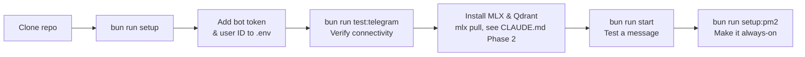
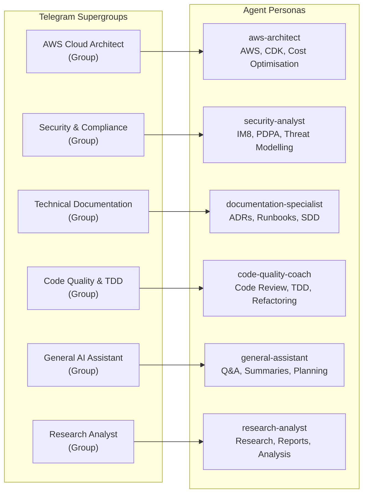
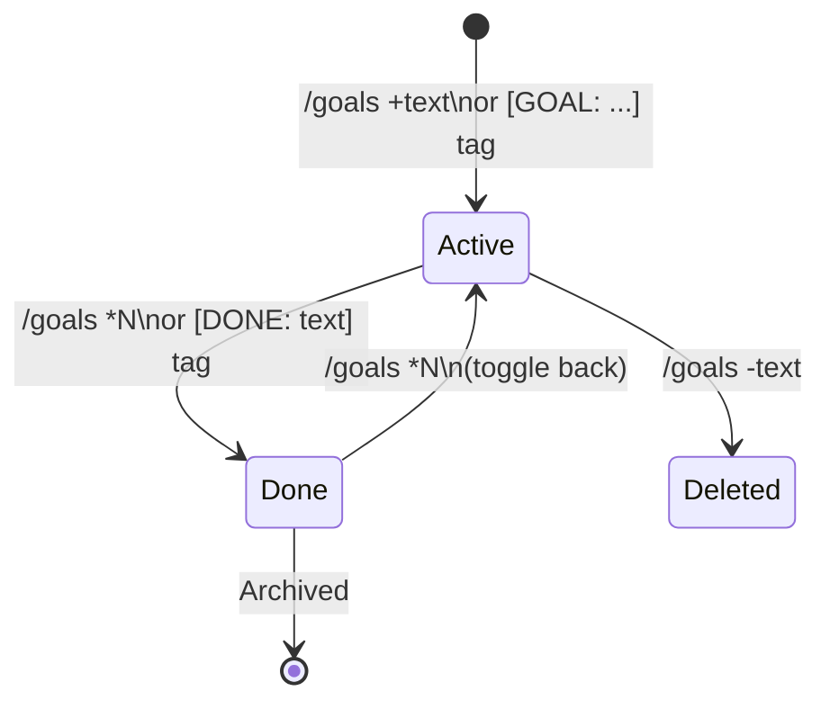
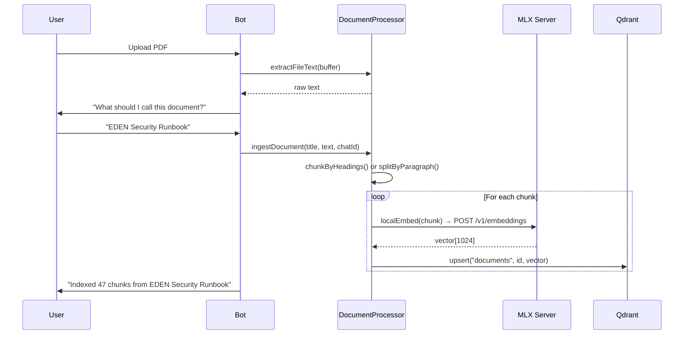

# Claude Telegram Relay — User Guide

**Version**: 1.1 | **Date**: 2026-03-23

---

## Table of Contents

1. [Getting Started](#getting-started)
2. [Talking to the Bot](#talking-to-the-bot)
3. [Model Selection](#model-selection)
4. [Bot Commands Reference](#bot-commands-reference)
5. [Multi-Agent Groups](#multi-agent-groups)
6. [Managing Memory](#managing-memory)
7. [Goal Tracking](#goal-tracking)
8. [Working with Documents](#working-with-documents)
9. [Voice Messages](#voice-messages)
10. [Starting Fresh](#starting-fresh)
11. [Troubleshooting](#troubleshooting)

---

## Getting Started

### Prerequisites

| Requirement | Version | Install |
|-------------|---------|---------|
| **Bun** | ≥ 1.0 | `curl -fsSL https://bun.sh/install \| bash` |
| **Claude Code CLI** | latest | `npm install -g @anthropic-ai/claude-code && claude login` |
| **MLX** | Python 3.12 + uv | `uv tool install --editable tools/mlx-local --python python3.12` |
| **Qdrant** | latest | Binary or Docker (see CLAUDE.md Phase 2) |
| **Git** | any | pre-installed on macOS |
| **Telegram** | any | Mobile or desktop app |

### Setup Flow



Run `bun run setup` first — it creates `~/.claude-relay/` directories, copies default prompts, and scaffolds `.env` from the template.

---

## Talking to the Bot

### Basic Conversation

Just send a message. The bot responds using Claude with your personal profile and memory context injected automatically.

```
You: What should I focus on today?
Bot: Based on your goals and yesterday's activity...
```

### Working Directory for Coding Sessions

If you want Claude to work in a specific directory (e.g., for code reviews or running commands), set it first:

```
/cwd /Users/you/projects/my-app
```

The bot locks this directory for the current Claude session. Use `/new` to reset.

### Progress Indicator

For long-running requests, the bot shows a "working..." indicator and updates it with live tool activity:

```
💭 Thinking...
🔧 bash: ls -la /src
📖 Read: src/relay.ts (lines 1-100)
✅ Done
```

You can cancel any in-progress request by tapping **Cancel** in the inline keyboard, or sending `/cancel`.

---

## Model Selection

By default the bot uses **Claude Sonnet**. You can override per-message with a prefix:

| Prefix | Model | When to use |
|--------|-------|-------------|
| *(none)* | Claude Sonnet | Default — balanced speed and quality |
| `[O]` | Claude Opus | Complex architecture, deep reasoning |
| `[H]` | Claude Haiku | Quick questions, low-latency responses |

**Example:**
```
[O] Architect a multi-tenant SaaS system with row-level security
[H] What's the capital of France?
```

---

## Bot Commands Reference

### Core Commands

| Command | Description | Example |
|---------|-------------|---------|
| `/help` | Show all available commands | `/help` |
| `/new` | Start a fresh Claude session | `/new` |
| `/status` | Show session info (model, session ID, context usage) | `/status` |
| `/cancel` | Cancel any in-progress Claude response | `/cancel` |
| `/cwd [path]` | Set or show working directory | `/cwd /Users/me/projects/app` |

### Memory Commands

| Command | Description | Example |
|---------|-------------|---------|
| `/memory` | Browse memory: facts, goals, dates, preferences | `/memory` |
| `/remember [text]` | Manually save a fact to memory | `/remember I prefer dark mode` |
| `/forget [text]` | Remove a fact from memory | `/forget old fact about X` |
| `/history` | View recent conversation messages | `/history` |

### Goal Commands

| Command | Description | Example |
|---------|-------------|---------|
| `/goals` | View all active goals | `/goals` |
| `/goals +[text]` | Add a new goal | `/goals +Deploy the new API by March 31` |
| `/goals -[text]` | Remove a goal | `/goals -outdated goal text` |
| `/goals *[N or text]` | Mark goal as done (toggle active/done) | `/goals *1` or `/goals *Deploy` |
| `/goals *` | View completed/archived goals | `/goals *` |

### Document Commands

| Command | Description | Example |
|---------|-------------|---------|
| `/doc list` | List all uploaded documents | `/doc list` |
| `/doc forget [name]` | Remove a document from memory | `/doc forget Q4 Report` |
| `/doc query [question]` | Search across all uploaded documents | `/doc query What is the SLA for production?` |

### Routine Commands

| Command | Description |
|---------|-------------|
| `/routines` | View and manage scheduled routines |

---

## Multi-Agent Groups

The relay includes 6 specialised agents, each in its own Telegram supergroup:



### Which Group to Use

| Task | Group |
|------|-------|
| Design AWS architecture, review CDK, cost estimates | **AWS Cloud Architect** |
| Security audit, IM8 compliance, threat models | **Security & Compliance** |
| Write ADRs, system design docs, runbooks | **Technical Documentation** |
| Code review, test generation, refactoring advice | **Code Quality & TDD** |
| Research a topic, generate a report | **Research Analyst** |
| Everything else — general Q&A, planning, summaries | **General AI Assistant** |

### Setting Up Groups (Phase 5)

1. Create a **Telegram Supergroup** with the exact name (e.g., `AWS Cloud Architect`)
2. Add your bot as **admin** to the group
3. The bot auto-discovers groups by matching title to agent name
4. Alternatively, set `GROUP_AWS_CHAT_ID=-100...` in `~/.claude-relay/.env`

### Customising Agent Prompts

Each agent's personality, focus areas, and output paths are defined in their prompt file:

```
~/.claude-relay/prompts/aws-architect.md        ← your personalised copy
config/prompts/aws-architect.md                 ← repo default (fallback)
```

Edit the user copy to change tone, domain focus, or preferred output format. Never edit the repo default.

---

## Managing Memory

The bot automatically extracts and stores facts from your conversations. You can also manage memory manually.

### How Memory Is Created

When Claude includes intent tags in its response, they are automatically processed:

```
[REMEMBER: Furi prefers dark mode and uses VSCode]
[GOAL: Complete EDEN security runbook by March 31 | DEADLINE: 2026-03-31]
[DONE: Draft initial architecture diagram]
```

These tags are stripped from the displayed response — you see clean text.

### Memory Browsing

Send `/memory` to browse your memory. You'll see an inline keyboard:

```
📌 Facts        🎯 Goals
📅 Dates        ⚙️ Preferences
```

Tap any category to browse entries. Each entry shows a snippet and options to delete.

### Manual Memory Management

```
/remember I prefer Terraform over CloudFormation for new projects
/remember Yi Ming is on leave 9–13 March 2026
/forget old incorrect fact
```

### Memory Scoping

| Type | Scope | Example |
|------|-------|---------|
| **Chat-scoped** | Visible only to the agent in that specific group | Architecture decisions for AWS group |
| **Global** (`[REMEMBER_GLOBAL:]`) | Visible to all agents across all groups | Your name, timezone, preferences |

---

## Goal Tracking

### Goal Lifecycle



### Working with Goals

**Add a goal:**
```
/goals +Deploy the relay bot as a template for other teams
/goals +Implement CLAUDE_MODEL_CASCADE by end of March | DEADLINE: 2026-03-31
```

**View active goals:**
```
/goals

🎯 Active Goals:
1. Deploy relay bot template [no deadline]
2. Implement CLAUDE_MODEL_CASCADE [due Mar 31]
```

**Mark as done:**
```
/goals *2
/goals *CLAUDE_MODEL_CASCADE
```

**View completed:**
```
/goals *
```

---

## Working with Documents

### Uploading a Document

Send any PDF, XLSX, or CSV directly to the bot (or to any group). The bot will:
1. Ask you to confirm the document title
2. Extract and chunk the text
3. Embed chunks into Qdrant
4. Confirm how many chunks were indexed

### Querying Documents

```
/doc query What are the IM8 requirements for data retention?
/doc query Summarise the Q4 budget assumptions
```

The bot performs semantic search across all chunks and injects the most relevant sections into Claude's context.

### Document Flow



### Managing Documents

```
/doc list                     → List all indexed documents with chunk counts
/doc forget EDEN Security Runbook  → Remove document from SQLite + Qdrant
```

---

## Voice Messages

Send a voice message and the bot transcribes it and responds as if you typed the text.

### Transcription Providers

| Provider | Config | Speed | Privacy |
|----------|--------|-------|---------|
| **Groq** (recommended) | `VOICE_PROVIDER=groq` + `GROQ_API_KEY` | ~0.5s | Cloud (Groq) |
| **Local Whisper** | `VOICE_PROVIDER=local` + binary path | ~2-5s | 100% local |

Configure in `~/.claude-relay/.env`. Test with `bun run test:voice`.

---

## Starting Fresh

### When to Use /new

Use `/new` when:
- You want to start a new topic unrelated to the current conversation
- The session is stuck or Claude seems confused
- You've completed a task and want a clean slate

```
/new
```

The bot resets the Claude session (clears `--resume` ID), increments the session generation counter, and starts fresh on your next message. **Memory (facts and goals) is NOT affected** — only the active conversation context is cleared.

### Session Resume

Between messages, the bot automatically tries to resume the Claude session:
- If last activity was **< 4 hours ago** → uses `--resume <sessionId>` (full context preserved)
- If **> 4 hours ago** → starts a new session, injects recent context as text
- If resume fails → shows "Inject context" button — tap to manually restore context

---

## Troubleshooting

| Symptom | Likely Cause | Fix |
|---------|-------------|-----|
| Bot not responding | Service offline | `npx pm2 status` — restart if `errored` |
| Response very slow | Large context window | `/new` to reset session |
| "Working..." never resolves | Claude stream hung | Send `/cancel` or restart relay |
| Memory not saving | Qdrant or MLX down | `curl http://localhost:6333/healthz`, `curl http://localhost:8800/health` |
| Voice not transcribing | Missing API key or binary | Check `VOICE_PROVIDER` + `GROQ_API_KEY` in `.env` |
| Document search returns nothing | No docs indexed or Qdrant down | `/doc list` to check, `bun run setup:verify` |
| Wrong group / agent not responding | Group not registered | Check `GROUP_*_CHAT_ID` or re-run `bun run test:groups` |
| Session resume fails every time | stale session file | `/new` to reset, or delete `~/.claude-relay/sessions/{chatId}*.json` |
| Routine messages not arriving | autorestart loop or PM2 cron | `npx pm2 logs morning-summary --lines 50` |

For deeper diagnostics, see [observability.md](observability.md).
